# WRO Future Engineers - MINAGURO
<p align="center"></p>

[](https://www.youtube.com/@minagurowro2026)

<div align="justify">Hello, welcome to the GitHub repository of the <strong>MINAGURO team</strong>, which is competing in the <strong>World Robot Olympiad 2026 Future Engineers</strong> category. Our team is made up of four Spanish students who built this robot on their school breaks with the aim of learning as much as possible.
<br> Guided by our passion for technology, we have created a vehicle that maybe doesn´t work as we would like to, but reflects all of our hard work and time spent on it.
 
  ## 📁 TABLE OF CONTENTS
* [1. 📝 Daily documentation](#1--daily-documentation)
* [2. 🛠️ Mechanical Design](#seccion-mecanica)
* [3. 🪛 Mobility design](#3--mobility-design)
* [4. ⚡Power and Sensor Architecture](#4--power-and-sensor-architecture)
* [5. 🧠 Strategy](#5--strategy)
* [6. 👥 The Team ](#6--the-team)
* [7. 🤖 Our Robot](#7--our-robot)
* [8. 💻 Software](#8--software)

### 1. 📝 Daily documentation
Here you can find the detailed progress of the MINAGURO team during the tournament:

<details>
<summary><b>🔍 March 2026</b></summary>
<br>
 
* **04/03/2026:** We began dividing up the work among the group, agreeing that Miguel and Rocío would handle the robot and the documentation, and Natalia and Guillermo would handle the programming. We also discussed the general features of the project. After watching videos of models from previous years and given that the robot’s maximum dimensions are 30x20 cm (which we felt was too large), we decided to try to make it as small as possible, since smaller robots tend to be more mobile and would also make it easier to avoid obstacles. Regarding the choice of the base board, we had four options: Raspberry Pi, Arduino R3, and Arduino R4 (with and without Bluetooth/Wi-Fi modules). Of these, we chose the Arduino R4 Minima (without Bluetooth/Wi-Fi) because it has a much faster protocol and more memory, and because the C++ used is a programming language we were already familiar with, which would make it easier for us to program; furthermore, it is compatible with the HUSKYLENS camera we already had and decided to use.  

* **05/03/26:** We looked for components in our classroom that could be used to build the robot and researched strategies from previous years on GitHub. 

* **06/03/26:** We decided on a basic strategy for the first and second challenges:  
  * First challenge:</ins> do not use HUSKYLENS; navigate as close as possible to the interior partitions to speed up the process; detect walls using distance sensors.  
  * Second challenge:</ins> use HUSKYLENS to detect obstacles and record their color, and distance sensors to measure the distance to the walls. 

* **09/03/26:** We researched the best way to move the robot; to do this, we looked at different models of remote-controlled cars, past projects we found in class, and GitHub repository files. In the end, we concluded that it would be best to have four wheels: two in front to control steering and two in the back to move it.  

* **10/03/26:** While reading the contest rules, we ran into a problem; we realized we couldn’t use a motor for each wheel, so we explored how we could drive both wheels with a single motor while still allowing them to operate independently in order to navigate curves. Ultimately, we agreed that the best solution would be to use a mechanical differential.  

* **11/03/26:** We searched and asked acquaintances for a differential or an old remote-controlled car to use in the project. Since no one had one, we started looking on different websites for a cheap, small differential that we could use for our robot. Finally, we settled on a front-axle differential from a remote-controlled robot that we found on AliExpress (even though we’ll be using it for the rear axle, since that doesn’t affect us) because it’s standard quality, inexpensive, and shipping isn’t too slow.  

* **12/03/26:** We discussed the distance sensors we’re going to use. In class, we have the following types: 
  * HC-SR04:</ins> ultrasonic distance sensor, works at a distance of up to four meters, digital pin connection, less accurate, sensitive to different types of surfaces and noise, very bulky.   
  * CJVL53L0XV2:</ins> laser distance sensor, works at a distance of up to two meters, I2C connection, high precision, compact, very low power consumption.  
  * TOF10120:</ins> laser distance sensor, operates at a range of up to 1.8 meters, I2C and UART connectivity, fast readings, large 10cm blind spot.  
With all this in mind, we decided to try the CJVL53L0XV2 laser sensors, as they offer the most benefits; we also decided to use three of them (one in front and two on each side) so we can measure the distance to the exterior walls at the front and the distance to the central partition on the sides.  

* **13/03/26:** We remembered that both HUSKYLENS and the laser distance sensors use the I2C protocol, so we decided to check that the addresses they use do not conflict. Once we verified this, we realized we had forgotten that, since the three distance sensors we plan to use are identical, they all use the same address. After writing a program to change the bus address and failing to get it to save, we agreed that having to change the address every time the program starts would waste time and add complexity to the program; so we decided to come up with another strategy individually and then pool our ideas.  

* **16/03/26:** After pooling all our ideas, we decided that the best option would be to use the HC-SR04 distance sensors, which, although less precise, we were already familiar with—an advantage when it comes to programming. Meanwhile, we began studying the HUSKYLENS AI camera, specifically its different modes, to see which one would be most useful to us. 

* **17/03/26:** We discussed how we could power the robot. We have eight rechargeable lithium batteries (model SAMSUNG ICR18650-26FU). We used this type of battery last year to build a PRINTBOT Evolution BQ robot, so based on that experience, we considered the best way to use them to ensure optimal battery life and minimize the space they occupy. We’re going to connect two cells in series to get 3.7 + 3.7 = 7.4 V, although when fully charged they actually reach 8.4 V. However, that voltage is ideal for powering the Arduino via Vin and for powering the drive servo directly from the batteries. For the Huskylens module, we plan to power it from the Arduino, but we’ll need to run tests because it has high power consumption. As for capacity, we need to look at the power consumption of each component and add them up to see how long they’ll last. 

* **18/03/26:** We looked for LEGO pieces in the sets we have in class for both the drive and steering wheels, as well as for the front-wheel steering system. To design the latter, we drew inspiration from how the steering systems of most remote-controlled cars are built and created a diagram of how we could assemble it using the pieces we have.   

* **19/03/26:** We assembled the steering system using LEGO pieces and a servomotor we had in class. Additionally, since we had already reviewed all of HUSKYLENS’s functions, we agreed that the most useful ones would be object recognition and color recognition, so we began researching these in greater depth and studying the library we found in its GitHub repository. 

* **20/03/26:** We created a program to rename the objects and colors we captured with the camera, since we thought this would make it easier to refer to the objects both within the rest of the program and visually on the camera screen. In doing so, we realized we had a problem: when we set HUSKYLENS to object detection mode, it always detected an object, even if the recorded objects weren’t visible. Since in this mode HUSKYLENS always had to have an object located, even if it didn’t exist, we decided it would be better to forget about using it and change our strategy for the second challenge. We will try to complete it by using the distance sensors both to maintain the distance from the central wall and to detect obstacles and steer toward them, and HUSKYLENS to determine the color of said obstacle. 

* **23/03/26:** Since we received the differential, we’ve been testing it; in doing so, we noticed that because it was new, the gears had trouble meshing properly—in other words, it didn’t run smoothly and fluidly. So we took it apart, lubricated it, and wore down the gear teeth by spinning them with a drill. On the other hand, since we now have the differential, from all the wheels we managed to collect, we chose the ones that worked best with both mechanisms. Finally, for the drive wheels, we chose larger ones because the bigger the wheels, the further the robot moves, and to match the size of the differential; and for the steering wheels, we chose smaller ones because we didn’t have any others of the same size. 

* **24/03/26:** We attached a 360° servo motor we have in class to the differential to check its speed, and we all agreed that it was moving too slowly. Therefore, we decided to increase the speed using a gear system. To do this, since we don’t have any gears that fit perfectly with the differential, we decided to design one in 3D and attach another one from the classroom LEGO kit. We also took the opportunity to design some couplings to attach the wheels to the differential.  

* **25/03/26:** We continued working on the 3D designs and researching HUSKYLENS. 

* **26/03/26:** We continued working on the 3D designs and created a program that moves a servo when HUSKYLENS detects an object in the center of the camera’s field of view; we did this simply to test whether we can use the camera to determine the object’s position in addition to detecting its color. 

* **27/03/26:** We finished the 3D designs and sent them to print on the school’s 3D printer. Additionally, after creating the previous program, we decided it might be a good idea to use coordinates instead of the object’s approximate position; therefore, we wrote a program that displays the center coordinates on the serial monitor.

</details> 

<details>
<summary><b>🛠️ April 2026</b></summary>
<br>
 
* **08/04/26:** We drew a diagram of how we want to assemble our robot and how we’re going to arrange all the components. We placed the HUSKYLENS at the front to detect colors, positioned a distance sensor on each side so we can measure using any of the four depending on what’s most useful, and placed the batteries under a platform with the wheels (and their respective servomotors), since this saves space and allows us to arrange the board and components more neatly above that platform. On the other hand, we considered different material options for the base, such as wood, plastic (3D printer), and a sheet of foam board we found in class. In the end, we decided that the foam board was the best option, since wood was very difficult for us to work with and would take more time, and 3D printing would also require a significant time investment (which would reduce our ability to test the program) and require us to have a clear understanding of all the component positions (something we weren’t 100% sure of yet). Even so, we decided this would be a temporary solution, and once we had everything figured out, we would make a 3D-printed base. 

* **09/04/26:** Using a clamp meter, we measured how much power our robot would consume to determine whether we could use the battery module we had chosen. We found that the HUSKYLENS camera uses between 230 and 420 mA, the Arduino R4 board consumes 100 mA, the HC-SR04 consumes 15 mA, the microservo consumes 200 mA, and the RC servo consumes 700 mA. Therefore, our robot would consume a total of 1215 mA, which would give us just over two hours of runtime. Theoretically, that would be the robot’s total power consumption, but in reality, we measured that the robot consumes 500 mA, so those batteries, which have a capacity of 2600 mAh, should power the robot for more than 5 hours. Meanwhile, we began preparing the wiring for the distance sensors and the servo motors. However, we noticed that the Huskylens module sometimes reboots. We think this is because the Arduino board isn’t able to provide enough power, and we can’t connect it directly to the batteries since the module doesn’t support 8.4 V. While searching for information, we found a type of regulator called the LM7805 that steps down the voltage to 5 V. We’ve decided to use it to power the Huskylens module.  

* **10/04/26:** We assembled the robot on the temporary base, trying to pack all the components as tightly as possible. We used hot glue because we had it in the classroom; it bonds strongly to the components we’re using, allows us to attach and detach components easily, and doesn’t damage them. During assembly, we had to cut a hole in the board to mount the 180° servo so it would align with the height of the wheels. Once the entire robot is assembled, we create a program to control it with a joystick and check the maximum and minimum values for each servo. The data we have for the servo are: 
  * Voltage: 4.8–8.4 V / Imax = 1.2 A / Maximum torque: 14 kg·cm / N = 65 rpm  
  * For the transmission, we have tested various LEGO gears. The differential has a 12/30 reduction ratio, meaning it reduces the speed by a factor of 2.5. Therefore, we need to multiply the speed between the servo and the differential. Through testing, we found that with a 40-tooth gear on the servo and a 13-tooth gear on the differential input, the vehicle achieves an appropriate speed—neither too fast nor too slow.  
  * Wheel speed calculation: V = 65 × (40/13) × (12/30) = 80 rpm = 1.333 rev/s  
  * The wheels have a diameter of 43 mm and a circumference L = π × 43 = 135 mm  
  * The vehicle’s speed is V = 1.3333 × 0.135 = 0.18 m/s. We have verified this data with a stopwatch, and it is correct. 

<div align="center"><table>
  <tr>
    <td align="center" width="33%">
      
    </td>
    <td align="center" width="33%">
      
    </td>
    <td align="center" width="33%">
      
    </td>
  </tr>
</table></div>

* **13/04/26:** We wrote a program using the distance sensors to make the rear servo move when an object is detected. In doing so, we realized that the library we had always used for these sensors isn’t compatible with the Arduino R4 Mini board, so we looked for another one. The other library we found that was compatible required a common pin to connect all the “triggers” from all the ultrasonic sensors. To do this, we rewired the setup by soldering all the trigger wires from the three sensors together and connecting them to a single pin.

* **14/04/26:** We started creating a basic program to try to navigate around the inside of the parking garage. As we continued testing the programs, we noticed that the robot was moving slower than we’d like, so we decided to increase its speed using a LEGO gear system we have in class. When we incorporated it, we saw that it wasn’t working well because the robot was turning jerkily, so we had to reduce the speed a bit. We thought it was a software issue, so we’re trying to fix it. 

* **15/04/26:** We were unable to fix the error by modifying the code, so we decided to change the gear system, this time using only one gear; as a result, it now moves slower than before, but faster than it did at the start. We also added a servo to the HUSKYLENS, as we believe it’s a good idea to use one because we think it has a narrow field of view, and with the servo attached, we’ll be able to rotate the camera and widen the angle. As for the program, the robot manages to turn around, but it makes very sharp turns, and when it gets too close, it crashes into the wall; we’re going to try to fix that. 

* **16/04/26:** We continue to plan our programs with the possibility of starting either to the right or to the left in mind, trying to check which way we’re going before leaving the parking lot. We have also added another HC-SR04 sensor at the rear to measure the distance to the parking space divider, making it easier for the program to exit the parking space. 

* **17/04/26:** We continued working on the programs, while also exploring options for exiting the parking lot; to do this, we drew inspiration from how participants in previous years had parked. During this process, we came across a robot that used a plastic rod that didn’t interfere with obstacles but allowed it to extend the robot’s length—and, therefore, the length of the parking space. Since we liked this idea, we decided to implement it and devise a parking strategy, taking into account that we now had a greater distance than we initially thought. With that in mind, we decided to create a program. 

* **20/04/26:** Since the front wheels keep jerking, we thought the 180-degree servo might be experiencing interference, so we decided to replace it with a better one we already had. It seems to work better, but it still malfunctions quite a bit. As for the program, we managed to get it to exit the parking space; so all that’s left is to have it face the central partition. We also tried using a magnetometer (compass) from class to get a reading of the robot’s position, with the idea of using it for various tasks like exiting the parking lot or making more precise turns. However, upon checking the readings, we saw that the coordinate intervals weren’t consistent and, therefore, didn’t match reality; we decided to order another one. 

* **21/04/26:** To try to fix the jerking issue, we installed some laser distance sensors and disabled the ultrasonic sensors. We tested them using a box (as if the box were the center of the board), and it worked quite well most of the time, except for a few instances where it didn’t read the position correctly. Next, we tested it on the official competition board; this time, 70% of the time it didn’t read the curves correctly and didn’t take the right direction. After further testing, we concluded that the problem with these sensors was the reflection of light off the black paint on the walls; therefore, they didn’t solve our initial problem. 

* **22/04/26:** We realized that if we connect HUSKYLENS directly to the board, the robot keeps stopping because the Arduino isn't able to power HUSKYLENS properly, causing it to reboot. From now on, we’ll power HUSKYLENS directly from the batteries using a voltage regulator based on the LM7805 circuit, which converts the batteries’ 8.4 volts to 5 volts—enough to power the camera on its own. On the other hand, since we had made so many changes to the robot’s chassis, the base was no longer stable or secure; so we decided it was time to design the final version in 3D. We drew a hand-drawn sketch of where the components would be placed and began designing it in 3D. 

* **23/04/26:** We continued working on the chassis design.  

* **24/04/26:** We are proceeding to replace all the sensors. We have once again used hot glue for the same reasons: it provides a strong, quick bond, is easy to apply and remove, and does not damage the components. In the process, we encountered several design issues that we resolved manually by removing material with a soldering iron to heat and melt the material into the desired shape, since we didn’t have enough time to redesign and print another part. Even so, we will redesign it in 3D so that the robot is perfectly reproducible. Also, since we were going to change the base, we decided to switch the gear ratio to a larger one to reduce the speed slightly. 

* **25/04/26:** We continued assembling the new base and also replaced some of the component cables. We decided to attach the distance sensors to a foam board using hot glue, since hot glue allows us to attach and remove the components easily without damaging them. 

* **27/04/26:** We installed the new magnetometer on the robot using a foam board rod to prevent interference issues and added an LCD display so we could view its readings without having to connect to the computer; once this was done, we began testing. The first few tests went well, but after about 10, it stopped working; we also tried the other one that came with the purchase, and the problem was the same as with the first one. We agreed to try one last time, so we ordered one final magnetometer.  

* **30/04/26:** We no longer have time to move forward with the challenge, so we began preparing all the documentation.

</details> 

<details>
<summary><b>🏆 May 2026</b></summary>
<br>

* **04/05/26:** We are still working on the documentation. 

* **19/05/26:** We are working on the final program and retouching the documentation.

* **26/05/26:** We reviewed what happened during the provincial round, as we had several execution errors due to a misinterpretation of the rules. We reread all the rules carefully and revised our strategy. In the free challenge, the robot starts from a specific zone within the region; whereas, in the obstacle challenge, there is the option to start from that same zone or from the parking area. We decided to take advantage of this option to differentiate the type of challenge the robot is facing.
  * Free challenge: we start from the required zone, “unpark”, complete the laps, count lines to stop, and “park”. All of this is done primarily using distance sensors, with the exception of line counting (for which we use HUSKYLENS).
  * Obstacle Challenge: we start from the parking spot, unpark, drive around while avoiding traffic lights, count lines to stop, find the parking spot, and park. All of this is done primarily using HUSKYLENS.<br>
  Once we’ve clarified all this, we get to work. Since the open challenge was almost complete, we redesigned the part about pulling out of the parking spot (which works for us); so all that would be left is counting the turns and parking, but since we don’t have time, we decided to prioritize solving the obstacle challenge.
* **27/05/26:** After testing the HUSKYLENS, we found that I2C communication causes fewer problems than using the serial port. Additionally, we decided to point the HUSKYLENS downward because when we first set it up, it was detecting colors and shapes outside its field of view, causing frequent errors. In light of this, we also positioned it higher to widen its field of view so it could see obstacles from a greater distance and detect them sooner. Additionally, we encountered an issue with the Arduino R4 Minima board (it stopped working); we believe it may have been caused by a power surge, but we’re not certain. Therefore, we decided to use the Arduino R4 board with Wi-Fi/Bluetooth that we had in class, without using its Wi-Fi and Bluetooth modes since that’s not permitted. As for the software, we first tested a program to count laps that we had already created but never got around to testing. After making some changes, we saw that it worked, so we decided to add it; however, as we mentioned yesterday, we decided not to deviate from the plan, to leave the parking part for later, and to focus on the obstacle challenge. Regarding this second challenge, we completed the part about exiting the parking lot and began developing a program that recognizes traffic light colors and avoids them.
  
* **28/05/26:** Despite our upcoming exams, we’re still dedicating time to finishing and optimizing the program. We’re continuing to work on the obstacle course challenge, but now we’ve decided to also use the object recognition feature since HUSKYLENS was confusing the orange lines with the red traffic lights; once we fixed that, we continued developing the program. On the other hand, the R4 board with Wi-Fi/Bluetooth stopped working at the end of the day; we think the same thing might have happened as with the previous one, but we’re not sure. From now on, we’ll take greater precautions when handling the board, turning it on, turning it off, etc. 
  
* **29/05/26:** We started the day by setting up the new Arduino R4 Mini we bought the day before yesterday, just in case it broke again, and carried on with the obstacle course challenge. We’ve made good progress today as we came to school for a couple of hours this afternoon. As for the obstacle course programme, we’ve managed to get it to go round the right or left depending on the colour of the object. We’ve also decided we should fit a micro-servo to the camera so it can search for objects after passing those it has already seen; we’ve cut out the 3D structure we made for it to fit the servo and ensure it remains at the same height. Due to a lack of time and the number of exams we have, we haven’t had time to continue working on or test the robot much on the circuit; furthermore, we won’t be able to incorporate the latest modification (the servo on the HUSKYLENS support) into GitHub for the reasons mentioned above.

</details> 

<details>
<summary><b>🔩 June 2026</b></summary>
<br>


* **08/06/26:** After winning the regional round and becoming champions of Castilla-La Mancha, we considered a number of changes and modifications that would help us improve the robot’s performance and our performance in the challenges.

* **14/06/26:** In the end, they approved any changes we wanted to make. The main changes were: replacing the ultrasonic sensors with laser sensors, and incorporating a microcontroller and possibly a microprocessor with fewer limitations than the Arduino R4 MINIMA, such as the Arduino Q or the Raspberry Pi Pico 2.

* **15/06/26:** We realised that the chassis plate – the one that holds all the sensors and servos in place – was bent, so we decided to redesign it and make it thicker to support the weight and prevent the same thing from happening again in the future.

</details> 

### <span id="seccion-mecanica"></span>2. 🛠️ Mechanical Design
This section is dedicated to the robot’s mechanical components: the list of parts used in its construction and the 3D-printed parts we designed and printed.

#### 2.1 Components List  
Here is a list of all components we used, including an image, their specific function in the robot, and a purchase link: 

| Component | Quantity | Preview | Main Function | Purchase link |
| :---: | :---: | :---: | :---: | :---: |
| SPT5632-360 | 1 | 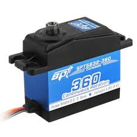 | Robot mobility | <a href="https://es.aliexpress.com/item/4001189631333.html?spm=a2g0o.detail.pcDetailBottomMoreOtherSeller.21.56e3gBQagBQake&gps-id=pcDetailBottomMoreOtherSeller&scm=1007.40050.354490.0&scm_id=1007.40050.354490.0&scm-url=1007.40050.354490.0&pvid=5e6d47a7-7388-4b21-b59b-0061086f9c61&_t=gps-id%3ApcDetailBottomMoreOtherSeller%2Cscm-url%3A1007.40050.354490.0%2Cpvid%3A5e6d47a7-7388-4b21-b59b-0061086f9c61%2Ctpp_buckets%3A668%232846%238110%231995&pdp_ext_f=%7B%22order%22%3A%22371%22%2C%22eval%22%3A%221%22%2C%22sceneId%22%3A%2230050%22%2C%22fromPage%22%3A%22recommend%22%7D&pdp_npi=6%40dis%21EUR%2110.79%2110.79%21%21%2184.16%2184.16%21%40211b6c1917779734902752140ebb0a%2110000015232527414%21rec%21ES%21135718878%21X%211%210%21n_tag%3A-29919%3Bd%3A2676a4e6%3Bm03_new_user%3A-29895&utparam-url=scene%3ApcDetailBottomMoreOtherSeller%7Cquery_from%3A%7Cx_object_id%3A4001189631333%7C_p_origin_prod%3A"> 🛒 Shop</a> |
| MS18 | 1 | 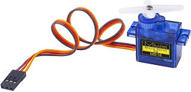 | Robot direction system | <a href="https://es.aliexpress.com/item/4001189631333.html?spm=a2g0o.detail.pcDetailBottomMoreOtherSeller.21.56e3gBQagBQake&gps-id=pcDetailBottomMoreOtherSeller&scm=1007.40050.354490.0&scm_id=1007.40050.354490.0&scm-url=1007.40050.354490.0&pvid=5e6d47a7-7388-4b21-b59b-0061086f9c61&_t=gps-id%3ApcDetailBottomMoreOtherSeller%2Cscm-url%3A1007.40050.354490.0%2Cpvid%3A5e6d47a7-7388-4b21-b59b-0061086f9c61%2Ctpp_buckets%3A668%232846%238110%231995&pdp_ext_f=%7B%22order%22%3A%22371%22%2C%22eval%22%3A%221%22%2C%22sceneId%22%3A%2230050%22%2C%22fromPage%22%3A%22recommend%22%7D&pdp_npi=6%40dis%21EUR%2110.79%2110.79%21%21%2184.16%2184.16%21%40211b6c1917779734902752140ebb0a%2110000015232527414%21rec%21ES%21135718878%21X%211%210%21n_tag%3A-29919%3Bd%3A2676a4e6%3Bm03_new_user%3A-29895&utparam-url=scene%3ApcDetailBottomMoreOtherSeller%7Cquery_from%3A%7Cx_object_id%3A4001189631333%7C_p_origin_prod%3A"> 🛒 Shop</a> |
| TFmini-S | 1 | 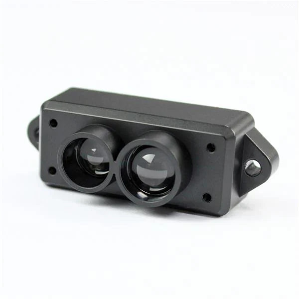 | Measure distances | <a href="https://es.aliexpress.com/item/1005008667948116.html?spm=a2g0o.productlist.main.1.3ee815f5aNKVGm&algo_pvid=7b97e392-40fa-4427-b546-e354d448a483&algo_exp_id=7b97e392-40fa-4427-b546-e354d448a483-0&pdp_ext_f=%7B%22order%22%3A%2233%22%2C%22spu_best_type%22%3A%22price%22%2C%22eval%22%3A%221%22%2C%22fromPage%22%3A%22search%22%7D&pdp_npi=6%40dis%21EUR%2139.58%2137.01%21%21%2144.77%2141.86%21%400b88a95617870674693428294e0f0b%2112000046162159304%21sea%21ES%210%21ABX%211%210%21n_tag%3A-29910%3Bd%3A7c99e0a1%3Bm03_new_user%3A-29895%3BpisId%3A5000000215237127&curPageLogUid=x2SCJyut26BJ&utparam-url=scene%3Asearch%7Cquery_from%3A%7Cx_object_id%3A1005008667948116%7C_p_origin_prod%3A"> 🛒 Shop</a> |
| T0F400F | 2 | 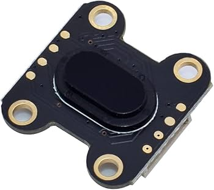 | Measure distances | <a href="https://es.aliexpress.com/item/1005006223800307.html"> 🛒 Shop</a> |
| LED | 2 | 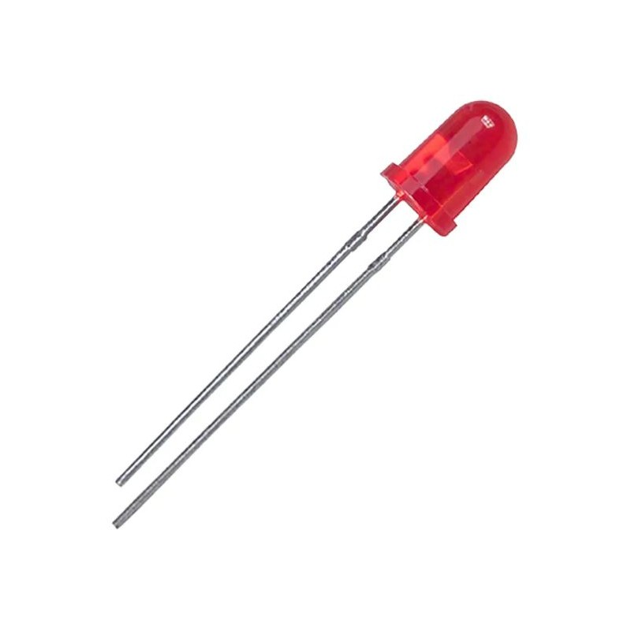 | Checkpoints | <a href="https://es.aliexpress.com/item/1005009812533874.html?src=google&snpsid=1&src=google&albch=shopping&acnt=439-079-4345&isdl=y&slnk=&plac=&mtctp=&albbt=Google_7_shopping&aff_platform=google&aff_short_key=UneMJZVf&gclsrc=aw.ds&albagn=888888&ds_e_adid=&ds_e_matchtype=&ds_e_device=c&ds_e_network=x&ds_e_product_group_id=&ds_e_product_id=es1005009812533874&ds_e_product_merchant_id=5551326180&ds_e_product_country=ES&ds_e_product_language=es&ds_e_product_channel=online&ds_e_product_store_id=&ds_url_v=2&albcp=21840696692&albag=&isSmbAutoCall=false&needSmbHouyi=false&gad_source=1&gad_campaignid=21844625911&gbraid=0AAAAACbpfvZrvUv7q62FHi_LcG387rL1_&gclid=CjwKCAjwhZDUBhBGEiwAbi5bjl9fKnxrPtUDux_-7zIYdKWsd6oaarbJUwohfb5DqGjQO7GFLHIvGRoCQ-wQAvD_BwE"> 🛒 Shop</a> |
| HUSKYLENS | 1 | 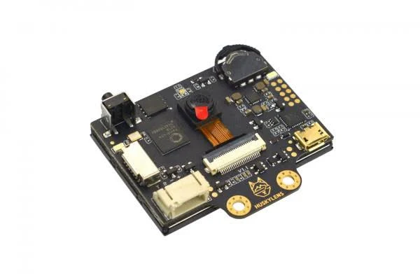 | Object detection | <a href="https://www.amazon.es/HUSKYLENS-inteligente-Seguimiento-Reconocimiento-etiquetas/dp/B089GLJHZD/ref=asc_df_B089GLJHZD?mcid=36800d9b99ce32ed8669f6a3e4ec2f84&tag=googshopes-21&linkCode=df0&hvadid=704489408389&hvpos=&hvnetw=g&hvrand=16285365096963908748&hvpone=&hvptwo=&hvqmt=&hvdev=c&hvdvcmdl=&hvlocint=&hvlocphy=9198870&hvtargid=pla-1463570363676&hvocijid=16285365096963908748-B089GLJHZD-&hvexpln=0&th=1"> 🛒 Shop</a> |
| Raspberry pi pico 2 rp2350 | 1 | 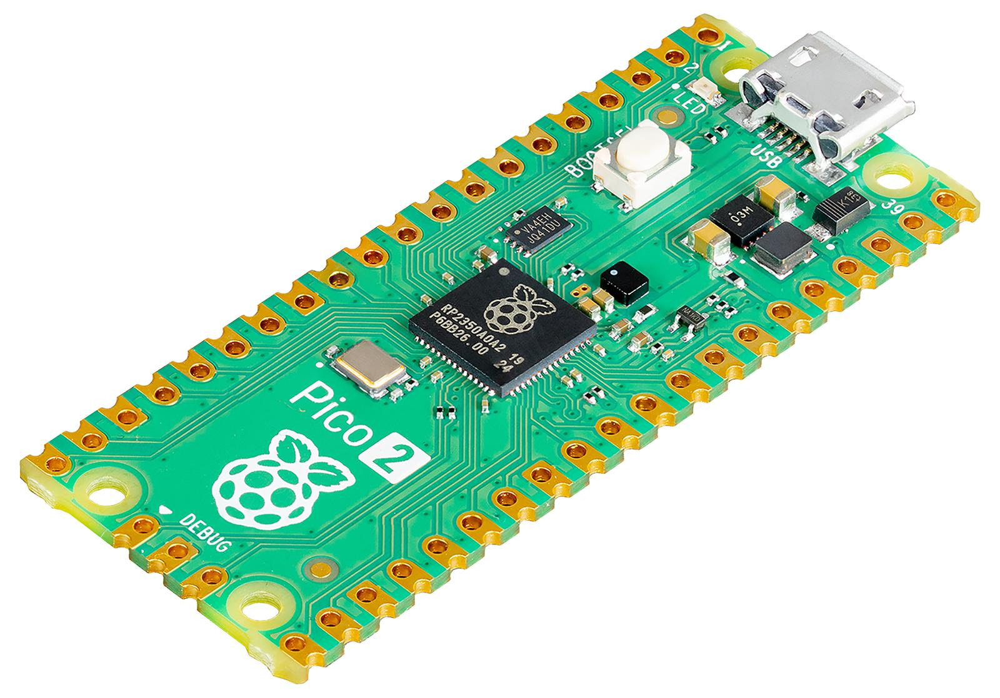 | Robot controller | <a href="https://www.amazon.es/HUSKYLENS-inteligente-Seguimiento-Reconocimiento-etiquetas/dp/B089GLJHZD/ref=asc_df_B089GLJHZD?mcid=36800d9b99ce32ed8669f6a3e4ec2f84&tag=googshopes-21&linkCode=df0&hvadid=704489408389&hvpos=&hvnetw=g&hvrand=16285365096963908748&hvpone=&hvptwo=&hvqmt=&hvdev=c&hvdvcmdl=&hvlocint=&hvlocphy=9198870&hvtargid=pla-1463570363676&hvocijid=16285365096963908748-B089GLJHZD-&hvexpln=0&th=1"> 🛒 Shop</a> |
| KS3017 Keyestudio Raspberry Pico IO Shield | 1 | 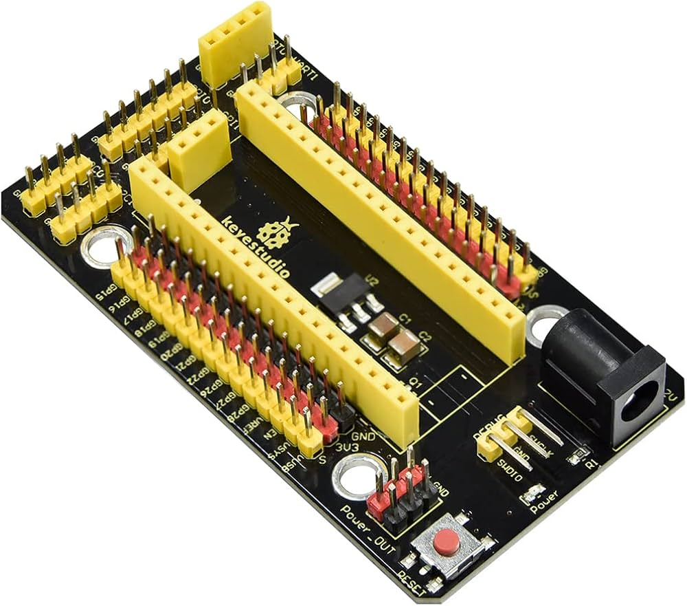 | Conexions | <a href="https://es.aliexpress.com/item/1005003882137188.html?src=google&src=google&albch=shopping&acnt=439-079-4345&isdl=y&slnk=&plac=&mtctp=&albbt=Google_7_shopping&aff_platform=google&aff_short_key=UneMJZVf&gclsrc=aw.ds&albagn=888888&ds_e_adid=&ds_e_matchtype=&ds_e_device=c&ds_e_network=x&ds_e_product_group_id=&ds_e_product_id=es1005003882137188&ds_e_product_merchant_id=109196579&ds_e_product_country=ES&ds_e_product_language=es&ds_e_product_channel=online&ds_e_product_store_id=&ds_url_v=2&albcp=21840696692&albag=&isSmbAutoCall=false&needSmbHouyi=false&gad_source=1&gad_campaignid=21844625911&gbraid=0AAAAACbpfvZrvUv7q62FHi_LcG387rL1_&gclid=CjwKCAjwhZDUBhBGEiwAbi5bjnHOuPztxLTIc_GugQviullqg1BSXDs9zjbAtSPCnMCuCgQurC9uAhoCwiIQAvD_BwE"> 🛒 Shop</a> |
| 10 DOF IMU sensor (L3GD20 - gyroscope) | 1 |  | Robot orientation | <a href="https://es.aliexpress.com/item/1005012492343486.html?pdp_npi=6%40dis%21EUR%216.87%216.39%21%21%2152.16%2148.52%21%402140da8b17866651436913401e0f59%2112000058549190449%21affd%21%21%21%211%210%21&dp=CjwKCAjwhZDUBhBGEiwAbi5bjpB5hRoc_Ad499S1rmuXgVQBdxh2cge1RWDi3WSjlPeaPdyvS_DJ_BoCq7sQAvD_BwE%7C0AAAAA_4-KEULbbQGD6FTmokvJ6HG6lL7m%7CCj4KCAjw4orUBhANEi4AroCGSwd44nWkEvukWXtTEEo0DP7dUrR6LF3R31k9k_HPmlAXdn5fS9rcJ9E1GgKsAw%7Cv1&cn=es_a&gad_source=1&aff_fcid=1368017dacb34b61b91334bc1acb7aa2-1787070286494-07841-_onKPRpM&aff_fsk=_onKPRpM&aff_platform=api-new-product-query&sk=_onKPRpM&aff_trace_key=1368017dacb34b61b91334bc1acb7aa2-1787070286494-07841-_onKPRpM&terminal_id=f61e0cd6284c4482af79c2354c1fbe5a&afSmartRedirect=y"> 🛒 Shop</a> |
| TCS34725 RGB sensor | 1 |  | Lines detection | <a href="https://es.aliexpress.com/item/1005007392355136.html?spm=a2g0o.productlist.main.9.438b53b0vumUmP&algo_pvid=9f62c521-d633-4081-831d-138e257ba32f&algo_exp_id=9f62c521-d633-4081-831d-138e257ba32f-8&pdp_ext_f=%7B%22order%22%3A%2219%22%2C%22eval%22%3A%221%22%2C%22fromPage%22%3A%22search%22%7D&pdp_npi=6%40dis%21EUR%213.59%213.59%21%21%2127.38%2127.38%21%4021038c6f17870711634791514e0f41%2112000040560020511%21sea%21ES%210%21ABX%211%210%21n_tag%3A-29910%3Bd%3A7c99e0a1%3Bm03_new_user%3A-29895&curPageLogUid=pstdMRsXjMhq&utparam-url=scene%3Asearch%7Cquery_from%3A%7Cx_object_id%3A1005007392355136%7C_p_origin_prod%3A"> 🛒 Shop</a> |
| Rocker Switch | 1 |  | Power on and off robot switch | <a href="https://es.aliexpress.com/item/1005008525408190.html?spm=a2g0o.productlist.main.17.431d74493KVuzo&algo_pvid=e9f9c09c-5089-4439-be0e-f05956214450&algo_exp_id=e9f9c09c-5089-4439-be0e-f05956214450-14&pdp_ext_f=%7B%22order%22%3A%22653%22%2C%22eval%22%3A%221%22%2C%22fromPage%22%3A%22search%22%7D&pdp_npi=6%40dis%21EUR%211.85%210.99%21%21%2114.40%217.69%21%402103890117771122923863735ec053%2112000045558767272%21sea%21ES%210%21ABX%211%210%21n_tag%3A-29910%3Bd%3A25dad6b%3Bm03_new_user%3A-29895%3BpisId%3A5000000204276354&curPageLogUid=KGO1IXkqj9GF&utparam-url=scene%3Asearch%7Cquery_from%3A%7Cx_object_id%3A1005008525408190%7C_p_origin_prod%3A"> 🛒 Shop</a> |
| Pull down button | 1 |  | Starter robot program button | <a href="https://es.aliexpress.com/i/1005002576288170.html"> 🛒 Shop</a> |
| Samsung battery 2600mAh | 4 |  | Batteries | <a href="https://bateriasonline.com/es/baterias-litio-recargable/bateria-litio-samsung-icr-18650-26j-2600mah-samsung-baterias-litio-recargable.html?srsltid=AfmBOop1R_bLE43Q_vkAh_JRYLJcKs3b_JRSsD6eFUK0Ot32YkWfNtN-"> 🛒 Shop</a> |
| Lego wheels 30,4x14 | 2 |  | Directional wheels | <a href="https://www.toypro.com/es/product/33208/rueda-18-mm-d-x-14-mm-con-agujero-para-pasador-pernos-falsos-y-radios-poco-profundos-con-llanta-negra-30-4-x-14-banda-de-rodadura-desplazada-55981-30391/gris-azulado-claro?srsltid=AfmBOooMGv7-eRncxEPbJrWFwlcMzZU4-aFSelHhvuYBHHatj6sHPQM1"> 🛒 Shop</a> |
| Lego wheels 13x24 | 2 |  | Drive wheels | <a href="https://www.steinpalast.eu/en/1-x-lego-brick-light-gray-wheel-30mm-d.-x-13mm-13-x-24-model-team-with-black-tire-13-x-24-model-team-2695-4141535-2696-269626-2695c01"> 🛒 Shop</a> |
| Servo arm | 1 |  | Servo direction arm | <a href="https://es.aliexpress.com/item/1005012158832496.html?spm=a2g0o.productlist.main.4.1edfnKTwnKTwnB&algo_pvid=5417366f-c791-4e53-a569-c27a98fc2162&algo_exp_id=5417366f-c791-4e53-a569-c27a98fc2162-3&pdp_ext_f=%7B%22order%22%3A%228%22%2C%22spu_best_type%22%3A%22price%22%2C%22eval%22%3A%221%22%2C%22fromPage%22%3A%22search%22%7D&pdp_npi=6%40dis%21EUR%216.85%212.65%21%21%2153.52%2120.74%21%40210384b217781457573274739eee2a%2112000057659670774%21sea%21ES%210%21ABX%211%210%21n_tag%3A-29910%3Bd%3Aa4bac484%3Bm03_new_user%3A-29895%3BpisId%3A5000000205922472&curPageLogUid=1s0ozgZzGPqi&utparam-url=scene%3Asearch%7Cquery_from%3A%7Cx_object_id%3A1005012158832496%7C_p_origin_prod%3A"> 🛒 Shop</a> |
| Gear teeth Lego 4285634 | 1 |  | Gear teeth transmission | <a href="https://www.electricbricks.com/lego-piezas-lego-technic,-engranaje-gris-claro-azulado-engranaje-dientes-p-425.html"> 🛒 Shop</a>|
| Lego structure piece 4495931 | 3 |  | Maintain direction structure | <a href="https://www.toypro.com/es/product/3937/liftarm-1-x-7-grueso/gris-azulado-oscuro?srsltid=AfmBOorBuWPTbd0rp7J5CSv3HlYMqGJvfZ5qkVGlDqX8xSTJyZnriyeG"> 🛒 Shop</a>  |
| Lego structure piece 4210686 | 3 |  | Connect directional wheels and connect them with the structure | <a href="https://es.aliexpress.com/item/1005011819503855.html?src=google&src=google&albch=shopping&acnt=439-079-4345&isdl=y&slnk=&plac=&mtctp=&albbt=Google_7_shopping&aff_platform=google&aff_short_key=UneMJZVf&gclsrc=aw.ds&albagn=888888&ds_e_adid=&ds_e_matchtype=&ds_e_device=c&ds_e_network=x&ds_e_product_group_id=&ds_e_product_id=es1005011819503855&ds_e_product_merchant_id=107567352&ds_e_product_country=ES&ds_e_product_language=es&ds_e_product_channel=online&ds_e_product_store_id=&ds_url_v=2&albcp=20542360520&albag=&isSmbAutoCall=false&needSmbHouyi=false&gad_source=1&gad_campaignid=17340214516&gbraid=0AAAAACbpfvYuNwQ1V3xDib2TlBxpflVYs&gclid=EAIaIQobChMIqZGIl6aflAMVnI5oCR199jqyEAQYAiABEgLzT_D_BwE"> 🛒 Shop</a> |
| Lego piece 4514554 (3 modules) | 3 |  | Connect the directional | <a href="https://www.toypro.com/es/product/1776/technic-pin-largo-sin-estrias-de-friccion-longitudinales/tan?srsltid=AfmBOoqqbuAxeT4ULrI73zVTMFH8t7_HuYIcuJz_XVb1vpj3KXK-qs8D"> 🛒 Shop</a> |
| Lego piece 4514553 (3 modules) | 4 |  | Connect the directional structure and connect it with chassis | <a href="https://www.toypro.com/es/product/2247/technic-pin-largo-con-estrias-de-friccion-longitudinales/azul?srsltid=AfmBOoqgtvS341U5QKuqMzuibB6NDnAIcyx8KQwD8Fsvz7nsYZRyQv2s"> 🛒 Shop</a> |
| Lego piece 4211807 (2 modules) | 2 |  | Connect the directional structure | <a href="https://www.toypro.com/es/product/756/technic-pin-sin-estrias-de-friccion-longitudinales/gris-azulado-claro?srsltid=AfmBOoqCiqgFyXZBCIu2rkTYcivDDJrr15Kn4coFCvSYRXdTXMta3fcI"> 🛒 Shop</a> |
| Lego piece 4495931 (2 modules) | 1 |  | Connect directional structure | <a href="https://www.toypro.com/es/product/1152/technic-pasador-de-eje-sin-estrias-de-friccion-longitudinalmente/tan?srsltid=AfmBOooZH7rHaNTKpPFgEphyQGzF2_0XQoAJPNM4Ki51-C_wdsH27EJX"> 🛒 Shop</a> |
| Lego piece 4560175 | 1 |  | Connect directional structure | <a href="https://www.toypro.com/es/product/2210/technic-pasador-largo-con-estrias-de-friccion-longitudinales-y-orificio-central-para-el-pasador/gris-azulado-claro?srsltid=AfmBOorSUHxEOJ2i5-85EPdvQcjwU1bGyXjPJdgFHhxL5Bt5vq-A_alA"> 🛒 Shop</a> |
| Lego piece 4107767 | 2 |  | Connect directional wheels with directional structure | <a href="https://www.toypro.com/es/product/577/eje-y-conector-de-pin-n-6-90/negro?srsltid=AfmBOorXiZJun_k-E2hKjYEJTn1MJVnT7njdhTR7xKyNWakuH3zyl84c"> 🛒 Shop</a> |
| Lego piece 4107085 | 2 |  | Connect directional structure | <a href="https://www.toypro.com/es/product/152/eje-y-conector-de-pin-n-1/negro?srsltid=AfmBOor2gTwMQ0SjiqnX9UFra149tetnTWeLNWH5GG9X5Cj_pXMF2bMb"> 🛒 Shop</a> |
| LM7805CT | 2 | 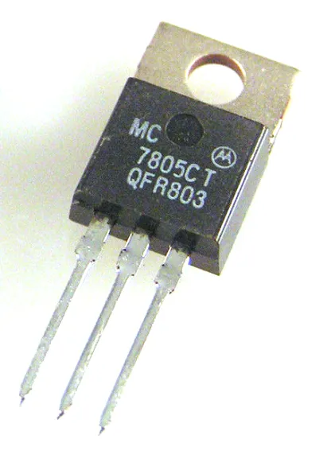 | Supply energy to huskylens directly of the batteries | <a href="https://richelectronics.co.uk/product/motorola-mc7805ct-3-terminal-positive-voltage-regulator-5-pieces-oma77"> 🛒 Shop</a> |
| Electrolytic condenser 0,1 microfarad | 1 |  | (maker recommendation) | <a href="https://www.nyerekatech.com/shop/0-1%C2%B5f-50v-electrolytic-capacitor/?srsltid=AfmBOoo2jnLNwXlnsHoz9CriiyzsWqAPUzHO8ErVziPrRmL6AmUMi83d"> 🛒 Shop</a> |
| Electrolytic condenser 0,33 microfarad | 1 |  | (maker recommendation) | <a href="https://www.tme.eu/en/details/uvy2dr33med/tht-electrolytic-capacitors/nichicon/"> 🛒 Shop </a> |
| Circuit board | 1 |  | Connect huskylens with the LM7805CT and then with batteries | <a href="https://www.pccomponentes.com/goobay-regleta-para-conexion-de-cables-electricos-de-10a-10mm-blanco?campaigntype=eshopping&campaignchannel=shopping&gad_source=1&gad_campaignid=12885548290&gclid=EAIaIQobChMI__yQzemhlAMVr3JBAh075B8YEAQYBSABEgLyYvD_BwE"> 🛒 Shop</a> |
| Differential QBX01 1:12 | 1 |  | It allows the drive wheels to rotate at different speeds on curves, preventing slippage | <a href="https://es.aliexpress.com/item/1005005425198232.html?spm=a2g0o.productlist.main.1.5afe3DuB3DuBQD&algo_pvid=89b2de5b-abad-4232-8ccb-d5e73895d3df&algo_exp_id=89b2de5b-abad-4232-8ccb-d5e73895d3df0&pdp_ext_f=%7B%22order%22%3A%22329%22%2C%22spu_best_type%22%3A%22price%22%2C%22eval%22%3A%221%22%2C%22fromPage%22%3A%22search%22%7D&pdp_npi=6%40dis%21EUR%219.53%215.53%21%21%2174.34%2143.14%21%402103892f17779733213802821e83c8%2112000033106328679%21sea%21ES%210%21ABX%211%210%21n_tag%3A-29910%3Bd%3A4f6c22e4%3Bm03_new_user%3A-29895%3BpisId%3A5000000205205646&curPageLogUid=a9DwnAg9v3GZ&utparam-url=scene%3Asearch%7Cquery_from%3A%7Cx_object_id%3A1005005425198232%7C_p_origin_prod%3A"> 🛒 Shop</a> |
| Power Expansion Board Module | 1 |   | It's a type of power bank where we've used the same Samsung batteries | <a href="https://es.aliexpress.com/item/1005001829484812.html?spm=a2g0o.detail.pcDetailTopMoreOtherSeller.3.3145BM7PBM7Pvs&gps-id=pcDetailTopMoreOtherSeller&scm=1007.40050.354490.0&scm_id=1007.40050.354490.0&scm-url=1007.40050.354490.0&pvid=aaef1a73-1862-4b0d-aa1e-1a9beffbe5b0&_t=gps-id%3ApcDetailTopMoreOtherSeller%2Cscm-url%3A1007.40050.354490.0%2Cpvid%3Aaaef1a73-1862-4b0d-aa1e-1a9beffbe5b0%2Ctpp_buckets%3A668%232846%238110%231995&pdp_ext_f=%7B%22order%22%3A%221076%22%2C%22eval%22%3A%221%22%2C%22sceneId%22%3A%2230050%22%2C%22fromPage%22%3A%22recommend%22%7D&pdp_npi=6%40dis%21EUR%212.06%212.06%21%21%212.34%212.34%21%402103909217800442825806414e0fc1%2112000017779552633%21rec%21ES%21135718878%21XZ%211%210%21n_tag%3A-29919%3Bd%3A2676a4e6%3Bm03_new_user%3A-29895&utparam-url=scene%3ApcDetailTopMoreOtherSeller%7Cquery_from%3A%7Cx_object_id%3A1005001829484812%7C_p_origin_prod%3A"> 🛒 Shop</a> |
| Micro Servo MG90S | 1 |  | Allow the camera to move and have a wider field of view | <a href="https://es.aliexpress.com/item/1005001829484812.html?spm=a2g0o.detail.pcDetailTopMoreOtherSeller.3.3145BM7PBM7Pvs&gps-id=pcDetailTopMoreOtherSeller&scm=1007.40050.354490.0&scm_id=1007.40050.354490.0&scm-url=1007.40050.354490.0&pvid=aaef1a73-1862-4b0d-aa1e-1a9beffbe5b0&_t=gps-id%3ApcDetailTopMoreOtherSeller%2Cscm-url%3A1007.40050.354490.0%2Cpvid%3Aaaef1a73-1862-4b0d-aa1e-1a9beffbe5b0%2Ctpp_buckets%3A668%232846%238110%231995&pdp_ext_f=%7B%22order%22%3A%221076%22%2C%22eval%22%3A%221%22%2C%22sceneId%22%3A%2230050%22%2C%22fromPage%22%3A%22recommend%22%7D&pdp_npi=6%40dis%21EUR%212.06%212.06%21%21%212.34%212.34%21%402103909217800442825806414e0fc1%2112000017779552633%21rec%21ES%21135718878%21XZ%211%210%21n_tag%3A-29919%3Bd%3A2676a4e6%3Bm03_new_user%3A-29895&utparam-url=scene%3ApcDetailTopMoreOtherSeller%7Cquery_from%3A%7Cx_object_id%3A1005001829484812%7C_p_origin_prod%3A"> 🛒 Shop</a> |"> Camera servo link </a> |

#### 2.2 3D Designs
These are the 3D designs we have created, which include: a custom-made chassis for all components, a gear to connect the differential to the 360-degree servo, a rear wheel adapter to connect the differential shaft to the wheels and a mount for the HUSKYLENS module:

| Component | Quantity | Image | Function | File link |
| :---: | :---: | :---: | :---: | :---: |
| Chasis in 3D | 1 | 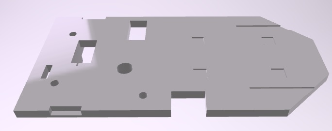 | Skeleton of the robot | [`📥Download`](CHASIS_modificado_2.stl) |
| Battery support 1 | 2 |  | Support batteries | [`📥Download`](soportebateria1.stl) |
| Battery support 2 | 1 | 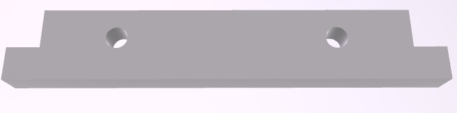 | Support batteries | [`📥Download`](soportebateria2.stl) |
| Switch support | 1 | 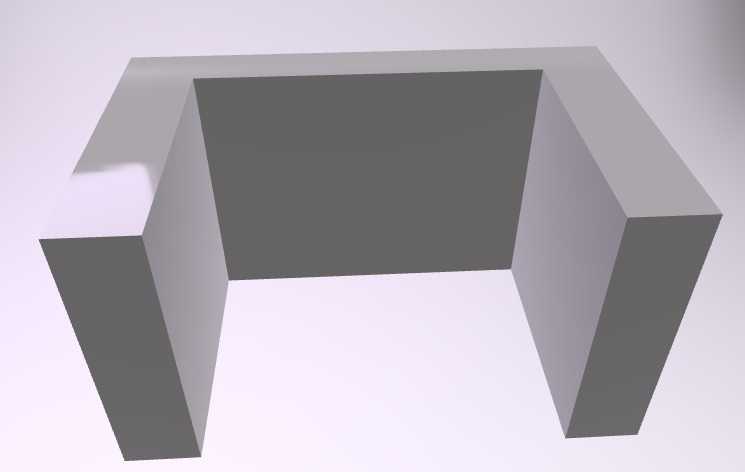 | Support the switch | [`📥Download`](SOPORTE_INTERRUPTOR.stl) |
| Adapter wheels in 3D | 2 |  | Supply energy to huskylens directly of the batteries | [`📥Download`](WHEEL_ADAPTER.stl) |
| Adapter gear in 3D | 1 |  | Gearing with 360º servo gear | [`📥Download`](GEAR_ADAPTER.stl) |

#### 2.3 Old Components
Here is a also a list of all components we used to use before our modifications; including an image, their specific function in the robot, and a purchase link: 

| Component | Quantity | Image | Function | Purchase link |
| :---: | :---: | :---: | :---: | :---: |
| HC-SR04RC | 2 | 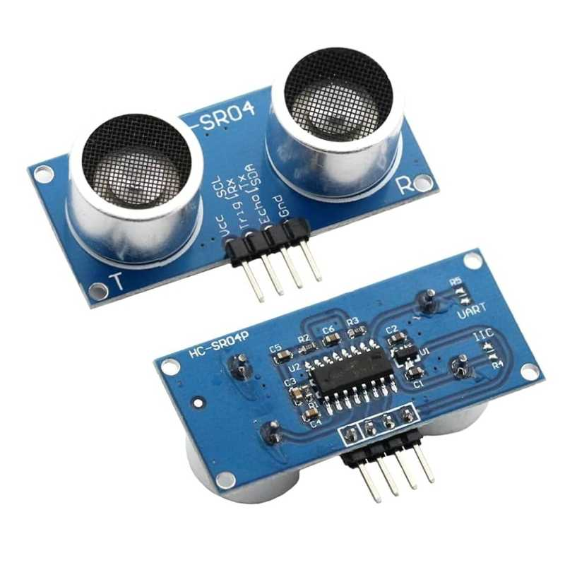 | Measure distances | <a href="https://www.tiendatec.es/maker-zone/modulos/2785-sensor-ultrasonico-hc-sr04rc-con-chip-rcwl-9616-gpio-uart-i2c-y-1-wire.html"> 🛒 Shop</a> |
| HC-SR04 | 2 | 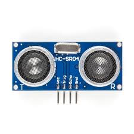 | Measure distances | <a href="https://es.aliexpress.com/item/1005010373195248.html?spm=a2g0o.productlist.main.1.4afa606fVeuEr0&algo_pvid=54f18ed3-18b2-4b6a-8dbc-cd5d3668bcef&algo_exp_id=54f18ed3-18b2-4b6a-8dbc-cd5d3668bcef-0&pdp_ext_f=%7B%22order%22%3A%2280%22%2C%22eval%22%3A%221%22%2C%22fromPage%22%3A%22search%22%7D&pdp_npi=6%40dis%21EUR%218.03%210.99%21%21%2162.67%217.74%21%40211b819117780681213312200e1d8a%2112000052180896573%21sea%21ES%210%21ABX%211%210%21n_tag%3A-29910%3Bd%3Aa4bac484%3Bm03_new_user%3A-29895%3BpisId%3A5000000203538426&curPageLogUid=QstesSY3YdXa&utparam-url=scene%3Asearch%7Cquery_from%3A%7Cx_object_id%3A1005010373195248%7C_p_origin_prod%3A"> 🛒 Shop</a> |
| Arduino R4 MINIMA | 1 |  | Robot controller | <a href="https://www.amazon.es/Arduino-UNO-Minima-ABX00080-Connector/dp/B0C78K4CD4"> 🛒 Shop</a> |
| Quick-connect panel | 1 |  | It allows us to connect all the sensors and servos to the Arduino thanks to all the pins it has |  <a href="https://es.aliexpress.com/item/1005007370390696.html?spm=a2g0o.detail.pcDetailTopMoreOtherSeller.5.3aeeiEwBiEwBEt&gps-id=pcDetailTopMoreOtherSeller&scm=1007.40050.354490.0&scm_id=1007.40050.354490.0&scm-url=1007.40050.354490.0&pvid=2b62d9e5-7337-4ba4-acd3-0fd85cbfbf2c&_t=gps-id%3ApcDetailTopMoreOtherSeller%2Cscm-url%3A1007.40050.354490.0%2Cpvid%3A2b62d9e5-7337-4ba4-acd3-0fd85cbfbf2c%2Ctpp_buckets%3A668%232846%238110%231995&pdp_ext_f=%7B%22order%22%3A%2231%22%2C%22eval%22%3A%221%22%2C%22sceneId%22%3A%2230050%22%2C%22fromPage%22%3A%22recommend%22%7D&pdp_npi=6%40dis%21EUR%212.59%212.23%21%21%212.95%212.54%21%400b8848bf17800920928475623e10c9%2112000056842030655%21rec%21ES%21135718878%21XZ%211%210%21n_tag%3A-29919%3Bd%3A2676a4e6%3Bm03_new_user%3A-29895&utparam-url=scene%3ApcDetailTopMoreOtherSeller%7Cquery_from%3A%7Cx_object_id%3A1005007370390696%7C_p_origin_prod%3A)"> 🛒 Shop</a> |
| Battery support | 1 | 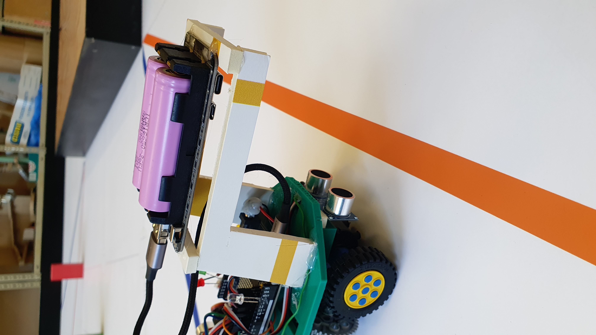 | Is the support of the second battery | We made it in class using a kind of cardboard and hot glue|
| Chasis in 3D | 1 | 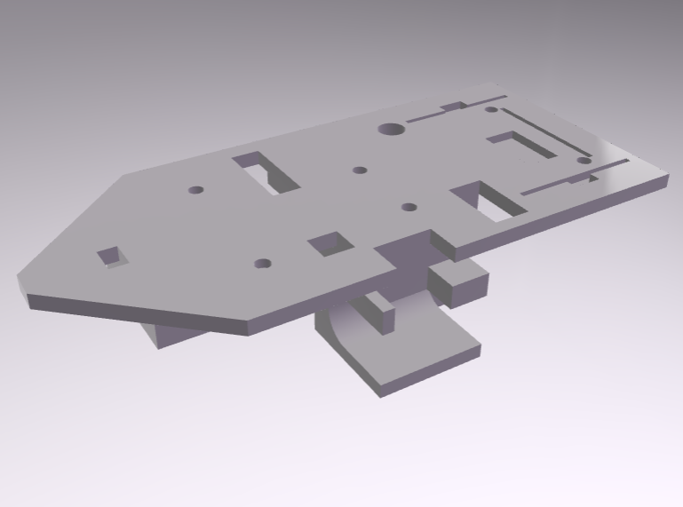 | Skeleton of the robot | [`📥Download`](CHASSIS.stl) |

### 3. 🪛 Mobility design
This section includes the robot's torque and speed, the rationale behind its final configuration, as well as images of all its plans and the wiring diagram we created in TinkerCad using all the robot's components. 

Generally speaking, the robot has:

* An Arduino R4 board (chosen based on previous experience programming it) 
* Four HC-SR04 sensors (one at the front, one at the rear, and two on the sides, one on each side): the front and side sensors are mounted on top of the chassis on a small piece of foam board to...; the rear sensor is mounted underneath the chassis due to space constraints at the rear top of the chassis. The triggers for the four sensors are soldered to the same pin to save pins on the Arduino board, in case more components need to be connected. 
* Four Samsung batteries... two of which power the Arduino board directly... 
* A 360-degree servo that functions as a servo motor. 
* A transmission system made with LEGO gears and one made with 3D-printed parts that runs from the servo motor to the mechanical differential. 
* A mechanical differential equipped with two adapters for 3D printers to ensure a better fit on the wheels. 
* Four LEGO wheels (two larger and two smaller: the specific models are listed in the parts list). 
* Un sistema de dirección de LEGO (piezas usadas en la lista de componentes). 
* An 180-degree servo to move the LEGO steering system via an arm attached to a string that runs to the steering system. 
* A HUSKYLENS module for detecting obstacles. 
* A foam board frame for holding a couple of batteries. 
* A switch to turn on the robot. 
* A button to start the program.

#### 3.1 Steering system 
The steering system used consists of:  

* A system made from LEGO bricks from our Technology class, because it’s easy to assemble and disassemble and can be put together fairly quickly in case modifications are needed, featuring two LEGO wheels that are smaller than the rear ones.  
* An 180-degree servo, since it’s easy to program and a larger turning angle wasn’t necessary given the system we built.  
* A servo arm with a string, to connect the LEGO steering system to the servo.

<table>
  <tr>
    <td align="center" width="33%">
      
    </td>
    <td align="center" width="33%">
      
    </td>
    <td align="center" width="33%">
      
    </td>
  </tr>
</table>

If this steering turned too far in one direction, it would jam and could break. To prevent this, we adjusted the values using the steering servo calibration program so that this wouldn’t happen.  

<div align="center"><table>
  <tr>
    <td align="center" width="50%">
      <b>Micro servo 180</b><br>
      
    </td>
    <td align="left" width="50%">
      <ul>
        <li>A:32mm</li>
        <li>B:23mm</li>
        <li>C:28,5mm</li>
        <li>D:12mm</li>
        <li>E:32mm</li>
        <li>F:19mm</li>
        <li>Speed:0,1sec</li>
        <li>Torque:2,5kg-cm</li>
        <li>Weight:14,7g</li>
        <li>Voltage:4,8-6V</li>
      </ul>
    </td>
  </tr>
</table></div>

#### 3.2 Drive system
The motor system used consists of: 

* A 360-degree continuous-rotation servo (model listed in the parts list). 
* A gear system to transmit motion from the servo motor to the mechanical differential, consisting of a 40-tooth LEGO gear and a 13-tooth gear made with a 3D printer. The gear ratio is 12:30. 
* A mechanical differential. The differential was purchased from AliExpress based on an idea from a previous project in our Technology classroom. 
* Two 3D-printed adapters that connect the differential shafts to the LEGO wheels. 
* Two LEGO wheels larger than those in the steering system.

<div align="center"><table>
  <tr>
    <td align="center" width="50%">
      
    </td>
  </tr>
</table></div>

The first 360-degree continuous rotation servo we installed caused smoothness issues when the robot moved, leading us to believe the problems were software-related; however, when it was replaced with another one we had in our classroom, the issues did not recur. 

The mechanical differential was a bit stiff to turn when it arrived. To make it turn more smoothly, we lubricated it with oil and turned it using a drill. 

The rear wheels are larger than the front wheels because the front wheels had to cover the height of the mechanical differential on their own; the front wheels already accounted for the height of the LEGO steering system.

#### 3.3 Chassis design

The chassis has evolved based on the need to add or remove components, and depending on what was most practical for meeting the challenges. 

Initially, we used a sheet of foam board that was in the classroom, onto which we gradually added all the components. To attach the components, we used hot glue (because it has good adhesive properties, allows us to make modifications easily, and doesn’t damage the components). In fact, the first prototype was tested with a foam board base. 

The front is cut into a pointed shape to prevent it from coming into contact with any of the interior partition walls or those of the parking garage during the obstacle phase. 

<div align="center"><table>
  <tr>
    <td align="center" width="33%">
      
    </td>
    <td align="center" width="33%">
      
    </td>
    <td align="center" width="33%">
      
    </td>
  </tr>
</table></div>

After confirming that this was the final base, we designed the chassis in 3D, printed it, and transferred the components from one base to the other. Although we thought this change might cause problems once everything was already assembled, there were none. 

<p align="center"><a src="3D_DESIGNS/CHASSIS.stl"></a></p>

The initial layout of all the components was sketched by hand to give us an idea (photos attached): 

<div align="center"><table>
  <tr>
    <td align="center" width="50%">
      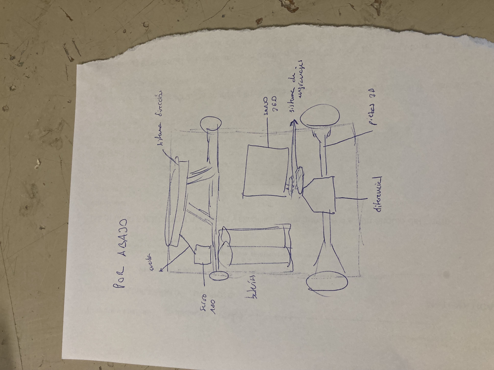
    </td>
    <td align="center" width="50%">
      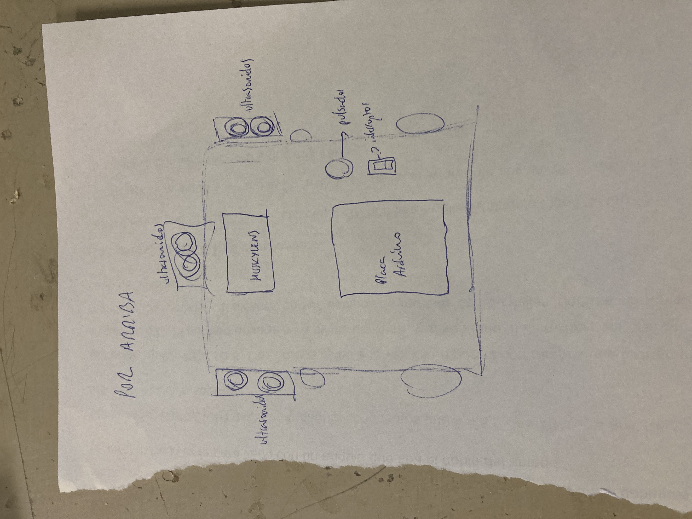
    </td>
  </tr>
</table></div>

An important consideration regarding the robot’s balance was to place the heaviest components (the Arduino board, the batteries, the 360-degree servo) in the center of the chassis, maintaining a low and centralized center of mass. The batteries that directly power the 360-degree servo (explained in detail below) are located in a separate structure, as this was a last-minute modification.

The robot remained in that state for a time until we encountered several problems and some broken circuit boards, which forced us to build a mount for a second battery, as recommended in the instructions.

<div align="center"><table>
  <tr>
    <td align="center" width="50%">
      
    </td>
  </tr>
</table></div>

Finally, the servo we fitted to the HUSKYLENS to make the camera rotate was causing problems, so we decided to remove it and build a 3D structure to hold it in place, allowing us to view objects and lines from a better angle without needing a servo. We also positioned the camera so that it was pointing slightly downwards, to avoid confusion with other objects and colours in the surroundings.

<div align="center"><table>
  <tr>
    <td align="center" width="49%">
      
    </td>
    <td align="center" width="49%">
      
    </td>
  </tr>
</table></div>

### 4. ⚡ Power and Sensor Architecture 

This section covers the power supply, the wiring diagram created in TinkerCad, and everything related to the sensors. 

#### 4.1 Power Supply 
The robot runs on four Samsung ICR18650-26FU batteries. Two of the batteries directly power the two mini-servos (the one on the HUSKYLENS module and the steering servo), the TF-Mini S sensor, and the Raspberry Pi Pico 2 board, while the other two power the drive servo and the HUSKYLENS.

An energy calculation was performed, taking all components into account, to help select the batteries:

* HUSKYLENS module: 230–420 mA.
* Raspberry Pi Pico 2 board: 40 mA
* TOF400F: 40 mA
* TFmini-S: 140 mA
* L3GD20 gyroscope: 6 mA
* 180 microservo: 200 mA
* 360° continuous rotation servo: 700 mA
* Total: approximately 1,550 mA

* Battery life for the traction servo and the HUSKYLENS camera (8.4 V and 2,600 mA): approximately 2,5 hours.
* Battery life for the Raspberry Pi Pico 2 board, TFmini-S sensor, and mini servos (4.2 V and 5,200 mA): approximately 12 hours.

This means we need to be careful with the batteries for the 360° servo and the HUSKYLENS module, as they may fail due to a lack of power.

Given this budget and the availability of batteries in our category, we chose the Samsung ICR18650-26FU model. The main features of this model are:

<p align="center">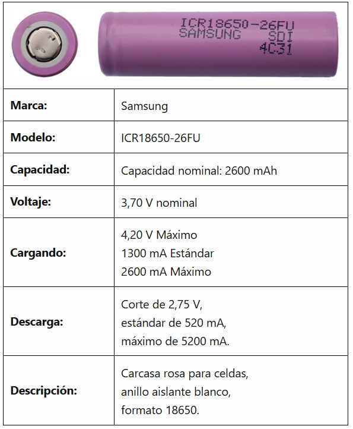</p>

The batteries that power the HUSKYLENS and the drive servo are housed in a battery expansion module on the bottom of the chassis. This way, you simply remove them and insert new ones when the battery runs out. Previously, they were placed in a dedicated space inside the 3D-printed chassis. Initially, in the prototype with a foam board base, they were glued to the bottom of the base, as can be seen in the initial sketches of the component layout. Later, it was decided to create a custom 3D-printed compartment for them in that same location.

<div align="center"><table>
  <tr>
    <td align="center" width="50%">
      
    </td>
    <td align="center" width="50%">
      
    </td>
  </tr>
</table></div>

As a last-minute modification, the batteries that power the Raspberry Pi Pico 2 board, the two microservos, and the TFmini-S sensor have been mounted on a 3D-printed structure at the top rear of the robot, inside a battery expansion module; this way, if some batteries run out, there’s no need to waste time disassembling the entire circuit to replace them—you simply remove them from there and swap them out. Additionally, this structure also expands the parking space, giving us more room to maneuver during the obstacle course. Initially, this structure was made of foam board, but it was eventually modified to use a more durable material.

<div align="center"><table>
  <tr>
    <td align="center" width="33%">
      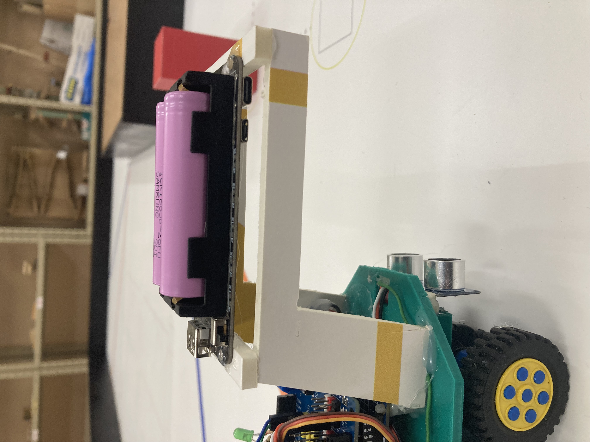
    </td>
    <td align="center" width="33%">
      
    </td>
    <td align="center" width="33%">
      
    </td>
  </tr>
</table></div>

To power the HUSKYLENS module, an LM7805 regulator has been included to step down the voltage from the batteries from 8.4 V to 5 V. Electrolytic capacitors have also been included as recommended by the manufacturer. 

#### 4.2 Wiring Scheme
The wiring diagram used for assembling the robot is shown in the image below. It was created in TinkerCad based on previous experience using this program. Some components were not available in TinkerCad, so similar ones that met the necessary connection requirements were used, and their names were noted on the final diagram to avoid confusion:


#### 4.3 Sensors 
The robot receives data from five main components: the Raspberry Pi Pico 2 board, the TFmini-S distance sensor, the TOF400F distance sensors, the HUSKYLENS module, and the TCS34725 RGB sensor.

The Raspberry Pi Pico 2 board was chosen after the regional competition. Initially, we used an Arduino R4 Minima board, but it was clear that a more powerful microcontroller was needed to handle such a large amount of data. There were other options, but they presented serious programming challenges. By using this board, the entire program was written in Python, which presented difficulties compared to the code from the regional competition, which was in C++.

This board is mounted on a KS3017 display to allow for convenient connection of the cables from the other components; otherwise, the cables for all components would have to be soldered.

<div align="center"><table>
  <tr>
    <td align="center" width="50%">
      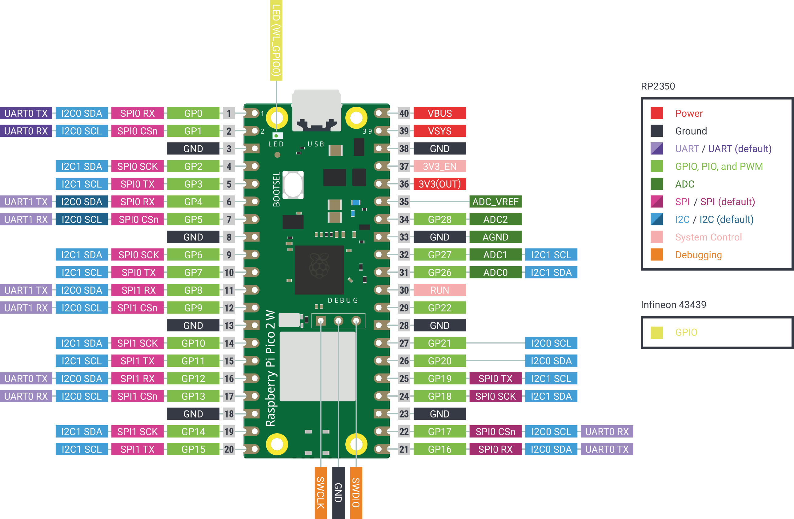
    </td>
   <td align="left" width="50%">
    <ul>
        <li>Dimensions: 21 mm x 51 mm</li> 
        <li>CPU: Dual-core Cortex-M33 or RISC-V Hazard3 processors at 150 MHz</li>            <li>Memory: 520 KB of on-chip SRAM</li> 
        <li>Flash: 4 MB of on-chip QSPI flash memory</li> 
        <li>Interface: 26 multipurpose GPIO pins (5V-tolerant), including 4 that can be used for ADC</li> 
        <li>Peripherals: 2 × UART, 2 × SPI controllers, 2 × I2C controllers, 16 × PWM channels, 1 × USB 1.1 and PHY controller, with support for host and device modes, 12 × PIO state machines</li> 
        <li>Power supply: 1.8–5.5 V DC</li>
      </ul>
    </td>
  </tr>
</table></div>

The TFmini-S sensor was chosen from among other options from the same manufacturer (as explained in greater detail in the project log); ultimately, this sensor has a detection range that is more than sufficient for the challenge, low power consumption, excellent accuracy, and a reasonable price. The other options were either too expensive or not up to par. Furthermore, during the regional phase, we had used HC-SR04 ultrasonic sensors, which worked at the time, but for this national phase we needed more accurate and reliable sensors, so we looked for laser sensors.

The sensor was also mounted on the HUSKYLENS servo because, initially, we weren’t going to use two TOF400F sensors—one, along with this one, would be sufficient. Therefore, it needed to be able to rotate to take measurements on both the left side and the front, given its reliability in doing so.

<div align="center"><table>
  <tr>
    <td align="center" width="50%">
      
    </td>
    <td align="left" width="50%">
     <ul>
        <li>Measurement principle: Time of flight (ToF) using a single-channel LiDAR sensor.</li>
        <li>Detection range: 0.1 meters to 12 meters</li>
        <li>Blind spot: 10 cm</li>
        <li>Sampling frequency: Adjustable between 1 Hz and 1,000 Hz (100 Hz by default)</li>
        <li>Accuracy: ±6 cm (from 0.1 to 6 m) / ±1% (from 6 to 12 m).</li>
        <li>Field of view (FoV): 2 degrees.</li>
        <li>Light source: 850 nm infrared VCSEL emitter (Eye Safety Class 1).</li>
        <li>Supply voltage: 5 V DC (±0.1 V)</li>
        <li>Current consumption: Average ≤140 mA (peaks of 200 mA)</li>
        <li>Dimensions and weight: 42 mm × 15 mm × 16 mm / 5 grams</li>
        <li>Ambient light immunity: Up to 70 Klux</li>
      </ul>
    </td>
  </tr>
</table></div>

The TOF400F sensors were chosen to replace the TFmini-S sensor, since the budget for two TFmini-S sensors was too high. After researching several options—and having previously evaluated the use of these TOF400F sensors in other versions of the robot—we decided to go with them. The measurements are also reliable, and the range is sufficient for the challenge.

However, there was a major problem when trying to incorporate the second TOF400F sensor, since the initial strategy was to use only one TOF400F sensor and one TFmini-S sensor. The problem was that, since the UART ports were already fully occupied, it had to be connected to an I2C port. Its performance on this port was significantly worse, so whenever possible, we used the TFmini-S sensor, which is much more reliable.

<div align="center"><table>
  <tr>
    <td align="center" width="50%">
      
    </td>
   <td align="left" width="50%">
    <ul>
        <li>Internal Core Chip: Based on the STMicroelectronics VL53L1X Time-of-Flight laser sensor.</li>
        <li>Useful Measurement Range: 4 cm – 400 cm (4 meters)</li>
        <li>Dead Zone (Maximum Proximity): 0 to 4 cm</li>
        <li>Supply Voltage: Supports 3.3V and 5V DC</li>
        <li>Current Consumption: ~20 mA in standby / ~40 mA maximum during laser emission</li>
        <li>Emitter Technology: 940 nm invisible infrared VCSEL laser</li>
        <li>Receiver Array: SPAD array</li>
        <li>Field of View (FoV): 27°</li>
        <li>Refresh Rate: Up to 50 Hz</li>
        <li>Ambient Light Immunity: Very high</li>
      </ul>
    </td>
  </tr>
</table></div>

The HUSKYLENS module identifies traffic light colors to navigate around them on the correct side. This module was new to us, so we had to meticulously study its features and how to program it. The most appropriate mode for this challenge is color detection. However, 70% of the time it confused the pink of the parking lot with the red of the traffic lights, which caused serious programming issues. 

One major issue it caused was that it sometimes interfered with other robot components. For example, while it was connected, the 360-degree servo wouldn’t rotate properly and would jam, but when it was disconnected, the servo rotated more smoothly.

<div align="center"><table>
  <tr>
    <td align="center" width="50%">
      
    </td>
   <td align="left" width="50%">
    <ul>
        <li>Dimensions: 21 mm x 51 mm</li> 
        <li>CPU: Dual-core Cortex-M33 or RISC-V Hazard3 processors at 150 MHz</li>            <li>Memory: 520 KB of on-chip SRAM</li> 
        <li>Flash: 4 MB of on-chip QSPI flash memory</li> 
        <li>Interface: 26 multipurpose GPIO pins (5V-tolerant), including 4 that can be used for ADC</li> 
        <li>Peripherals: 2 × UART, 2 × SPI controllers, 2 × I2C controllers, 16 × PWM channels, 1 × USB 1.1 and PHY controller, with support for host and device modes, 12 × PIO state machines</li> 
        <li>Power supply: 1.8–5.5 V DC</li>
      </ul>
    </td>
  </tr>
</table></div>

The TCS34725 RGB sensor was chosen after encountering problems with the previous strategy, which involved the HUSKYLENS detecting lines on the playing field and counting them; when it reached a certain value, the robot would stop a few seconds later in the correct quadrant. However, combining line counting with traffic light detection led to problems that prevented proper performance in the obstacle challenge.

The sensor is located on the lower front of the robot, although at one point it was mounted on the rear to detect a line at the start of the free challenge and thus determine the direction of the challenge. It is surrounded by a layer of black EVA foam to prevent interference from ambient light and ensure the sensor reads the light it reflects.

<div align="center"><table>
  <tr>
    <td align="center" width="50%">
      
    </td>
   <td align="left" width="50%">
    <ul>
        <li>Dimensions: 21 mm x 51 mm</li> 
        <li>CPU: Dual-core Cortex-M33 or RISC-V Hazard3 processors at 150 MHz</li>            <li>Memory: 520 KB of on-chip SRAM</li> 
        <li>Flash: 4 MB of on-chip QSPI flash memory</li> 
        <li>Interface: 26 multipurpose GPIO pins (5V-tolerant), including 4 that can be used for ADC</li> 
        <li>Peripherals: 2 × UART, 2 × SPI controllers, 2 × I2C controllers, 16 × PWM channels, 1 × USB 1.1 and PHY controller, with support for host and device modes, 12 × PIO state machines</li> 
        <li>Power supply: 1.8–5.5 V DC</li>
      </ul>
    </td>
  </tr>
</table></div>

### 5. 🧠 Strategy
Before focusing on each of the two types of challenges individually, we distinguish between them as follows: since the obstacle challenge allows us to choose between starting from the parking area specified in the free challenge or from the magenta parking lot, we choose to start from the magenta parking lot so that the starting area is different for each challenge, making it easier to tell them apart. Therefore, we start by checking the front distance; and, depending on whether it is greater or less than 40 cm, we know whether we are in the open challenge or the obstacle challenge, respectively. Once we know this, we proceed to analyze each challenge separately. 

#### 5.1 Open challenge
<div align="center"><table>
  <tr>
    <td align="center" width="50%">
      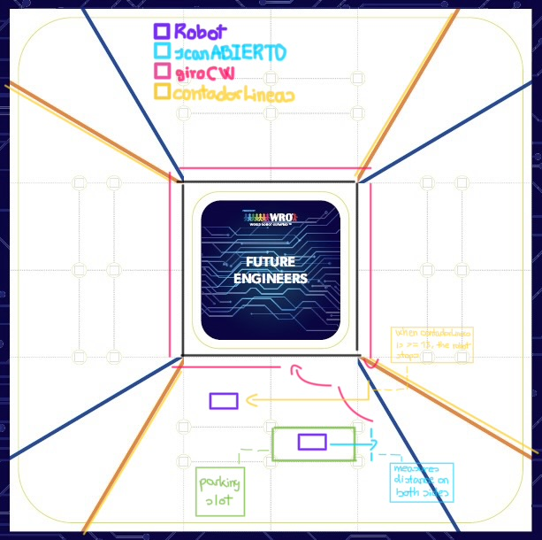
     clock-wise mode
    </td>
    <td align="center" width="50%">
      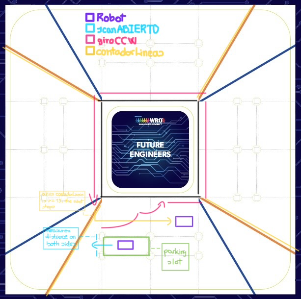
     counter clock-wise mode
    </td>
  </tr>
</table></div>

For this setup, we’ve decided to rely primarily on ultrasonic sensors, though we also use the HUSKYLENS machine vision camera. 
We start by exiting the parking area, then reverse to check which direction we’re facing (clockwise or counterclockwise). Then: 

* If the distance on the right is shorter than the distance on the left, we’re facing counterclockwise. Once we know this, we move forward to the center of the field and begin circling. We chose to go through the center of the field for two reasons: first, since we have to cover less distance, it would take us less time to complete the laps; second, we believe that, by using distance sensors, this option would be easier to program and cause fewer measurement issues. 
* If the distance to the right is greater than the distance to the left, we would be moving clockwise. Once we know this, we move to the center of the field and begin circling. We chose to go through the center of the field for the reasons explained in the previous paragraph. 

While this is running, we use HUSKYLENS to count the red lines on the field floor; this way, we can determine the number of laps the robot has completed and make it stop after completing the required three laps. 
We have not yet developed a specific strategy for parking in the parking zone due to lack of time; however, we continue to working on that.

#### 5.2 Obstacle challenge
<div align="center"><table>
  <tr>
    <td align="center" width="50%">
      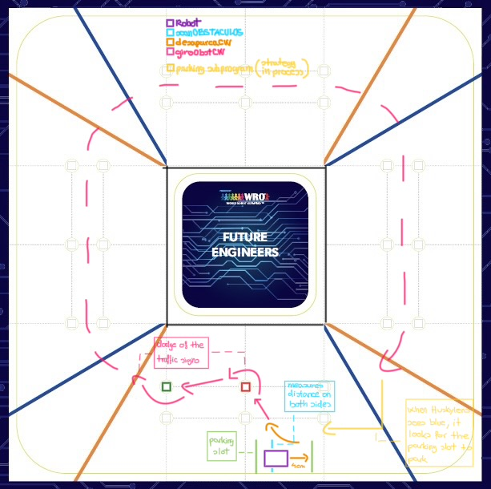
     clock-wise mode
    </td>
    <td align="center" width="50%">
      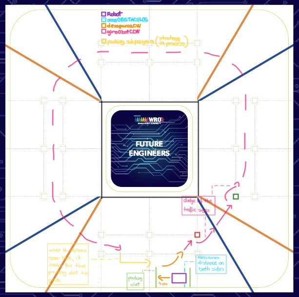
     counter clock-wise mode
    </td>
  </tr>
</table></div>

For this setup, we’ve decided to use HUSKYLENS for the most part, though we also use ultrasonic sensors. 
We start by exiting the parking lot, first checking the side distances to determine which of the two scenarios applies: 

* If the distance on the right is greater than on the left, we are moving clockwise. Once we know this, we reverse until we are 4 cm from the rear wall to give us more space to exit. Next, we exit the parking lot at just the right angle so that HUSKYLENS can see the first block we might encounter if it were there, and we begin the turn while avoiding obstacles. To do this, we use HUSKYLENS’s object recognition, since when we tested color recognition, it frequently confused the red of the traffic signs with the orange of the lines; once we’ve recognized the object, we approach it and switch the camera mode to color recognition to determine if it’s red or green and turn toward the corresponding side. Once we’ve avoided it, we use the HUSKYLENS and its servo motor to look for another obstacle, and so on.  
* If the distance on the right is shorter than on the left, we’re moving counterclockwise. Once we know this, we back up until we’re 4 cm from the back wall to give ourselves more room to exit. Next, we leave the parking lot at just the right angle so that HUSKYLENS can see the first obstacle we might encounter if it’s there, and we begin the turn while avoiding obstacles. The strategy followed is the same as that described in the previous paragraph.  

While this is being executed, we plan to use HUSKYLENS to count the blue lines on the field floor; this way, we can determine how many laps the robot has completed around the field and have it stop after completing the required three laps. However, we have not yet developed this idea due to a lack of time and the robot’s efficiency in completing the laps.  
Regarding the latter, we have a parking strategy in which we would use HUSKYLENS to detect the pink color of the parking lot once the laps have been completed and then park; this is an idea we haven’t fully developed yet, since we would first need to count the laps.  

Similarly, we continue to work on resolving and developing these issues. 


### 6. 👥 The Team
The Minaguro team from Herencia, Spain, is made up of dedicated and hardworking members led by a teacher. This is our first year competing in the WRO Future Engineers category, and each member brings important skills to the team.

<br> **Miguel**
<br> **Age:** 17
<br> **Description:** Hi, I'm Miguel from Ciudad Real, Spain, and this is my first time participating in WRO Competition. I have always been into mechanics and robot building, so I didn't hesistate to take up this challenge. I am such a curious and competitive person, and I had put all my efforts in helping the team.

<br> **Natalia**
<br> **Age:** 17
<br> **Description:** Hi, I am Natalia, also from Ciudad Real, Spain, and it is my first time participating, too. I am really good at programming, which I actually enjoy doing. I am hardworking and creative, and this competition, despite being really demanding, has helped me to enter the engineering world.

<br> **Rocío** 
<br> **Age:** 16
<br> **Description:** Hi! I'm Rocío from Spain and this is the first time in the WRO competition. Since I was a kid, I've loved solving puzzles and maths problems. I started to interest in robotics when I was at secondary school, when my teacher taught us how to program. I thougth that was really fun.

<br> **Guillermo**
<br> **Age:** 16
<br> **Description:** Hi, I am Guillermo. I am from Ciudad Real, Spain, and I joined this project because I have always been really keen on I.T. and problem solving. Although this competition has been really challenging, the experience with all the team is worth it.


### 7. 🤖 Our Robot
Here are some pictures of our robot to help with it´s reproducibility:
<div align="center"><table>
  <tr>
    <td align="center" width="33%">
      
     robot´s front view
    </td>
    <td align="center" width="33%">
      
     robot´s back view
    </td>
    <td align="center" width="33%">
      
     View from underneath the robot
    </td>
  </tr>
</table></div>

<div align="center"><table>
  <tr>
    <td align="center" width="33%">
      
     Robot’s right side view
    </td>
    <td align="center" width="33%">
      
     View of the robot's layout
    </td>
    <td align="center" width="33%">
      
     Robot’s left side view
    </td>
  </tr>
</table></div>

<div align="center"><table>
  <tr>
    <td align="center" width="50%">
      <b>Other robot´s views</b><br>
    </td>
<div align="center"><table>
  <tr>
    <td align="center" width="33%">
      
    </td>
    <td align="center" width="33%">
      
    </td>
    <td align="center" width="33%">
      
    </td>
  </tr>
</table></div>
<div align="center"><table>
  <tr>
    <td align="center" width="33%">
      
    </td>
    <td align="center" width="33%">
      
    </td>
    <td align="center" width="33%">
      
    </td>
  </tr>
</table></div>


### 8. 💻 Software
Here you can find almost all programs used in the development of our robot; including flowcharts, test programs and each version of the final program we have made.

#### 8.1 Old programs

<details>
<summary><b>📋 Test programs</b></summary>
<br>
 
These are all programs we used to calibrate our old sensors:

* <ins>Calibrate HCSR04 sensors</ins>
```cpp

//Program to calibrate HCSR04 sensors.
#include <HCSR04.h>

HCSR04 hc(2, new int[4]{3, 4, 5, 7}, 4); //initialisation class HCSR04 (trig pin , echo pin, number of sensor)
int lectura=0;
int distDE, distFR, distIZ, distTR;

#include <LiquidCrystal_I2C.h>
LiquidCrystal_I2C lcd(0x27,20,4);

void setup()
{ 
  lcd.init(); //inicializa el display
  lcd.backlight(); //Activa la retroiluminación
  lcd.clear();
 
 }

void loop()
{
  lcd.clear();
  
  lcd.setCursor(0, 0);// coloca el cursor en la columna 0, linea 0
  lcd.print("Dist Dcha= ");
  lectura=(int)hc.dist(0);
  if (lectura < 2 || lectura > 300) {
  distDE = distDE; }
  else{distDE=lectura;}
  lcd.print(distDE);
  delay(60);

  lcd.setCursor(0, 1);// coloca el cursor en la columna 0, linea 0
  lcd.print("Dist Fron= ");
  lectura=(int)hc.dist(1);
  if (lectura < 2 || lectura > 300) {
  distFR = distFR; }
  else{distFR=lectura;}
  lcd.print(distFR);
  delay(60);

  lcd.setCursor(0, 2);// coloca el cursor en la columna 0, linea 0
  lcd.print("Dist Izda= ");
  lectura=(int)hc.dist(2);
  if (lectura < 2 || lectura > 300) {
  distIZ = distIZ; }
  else{distIZ=lectura;}
  lcd.print(distIZ);
  delay(60);

  lcd.setCursor(0, 3);// coloca el cursor en la columna 0, linea 0
  lcd.print("Dist Tras= ");
  lectura=(int)hc.dist(3);
  if (lectura < 2 || lectura > 300) {
  distTR = distTR; }
  else{distTR=lectura;}
  lcd.print(distTR);
  delay(60);

delay(400);
}

```

* <ins>Calibrate drive servo</ins>

```cpp

//Program to calibrate the drive servo

#include <Servo.h>
Servo SERVOx;

int JOYx = A0;   //LECTURA:   0--508-1023

int Sx=0;


void setup() {

SERVOx.attach(9);  // vincula el servo al pin digital 6


Serial.begin(9600);

  }

void loop(){
  JOYx = analogRead(A0);
  
Sx = map(JOYx, 0, 1023, 55, 125); //map(value, fromLow, fromHigh, toLow, toHigh) 360º 60(dcha)-120(izda)


SERVOx.write(Sx);


Serial.print("JOYx=");
Serial.print(JOYx);


Serial.print("  Sx= ");
Serial.println(Sx);

delay(100);
}

```

* <ins>Calibrate steering servo</ins>

</details>

<details>
<summary><b>💻 Final program</b></summary>
<br>
 
This is our old final program, which allowed us to reach the national WRO final:

```cpp
#include <HUSKYLENS.h>  //Cable verde al A4  y   cable azul al A5
#include <Wire.h>
HUSKYLENS huskylens;
const int rojo = 1;
const int verde = 2;

#include <HCSR04.h>
HCSR04 hc(2, new int[4]{3, 4, 5, 7}, 4); //initialisation class HCSR04 (trig pin , echo pin, number of sensor)

#include <Servo.h>
Servo servoTraccion;
Servo servoDireccion;
Servo SERVOcam;

#define ledV 14
#define ledR 15

int i=0;
int dir=90;     
int distDE=15;  // SENSOR 0 derecho
int distFR=110; // SENSOR 1 frontal
int distIZ=15;  // SENSOR 2 izquierdo
int distTR=15;  // SENSOR 3 trasero

// Variables control servos
int Izda=134;
int Dcha=54;
int Recto=94;
int Para=90;
int Avanza=0;
int Retrocede=180;
int lectura=0;
int CASO;

//variable para esquivar obstáculos.
int anguloCam = 86;           // guarda la posicion actual del servo de la camara
int direccionBarrido = 5;     // velocidad y sentido del barrido (positivo derecha, negativo izquierda)
unsigned long tiempoCam = 0;  // controla el refresco del movimiento del servo de la camara
int ladoBusqueda = 1; // 1 = empezar a la derecha, 2 = empezar a la izquierda

//variables para contar vueltas en el desafío libre.
int contadorLineas = 0;              // guarda las lineas rojas que va cruzando
unsigned long tiempoBloqueoRojo = 0; // guarda el momento exacto en que pisa el rojo
bool rojoBloqueado = false;          // bandera para saber si esta en el tiempo de espera

void setup()
{ //Serial.begin(9600);
Wire.begin(); // Iniciar el bus I2C
pinMode (12, INPUT);
pinMode (13, OUTPUT);
pinMode(ledV, OUTPUT); //led verde
pinMode(ledR, OUTPUT);  //led rojo

servoTraccion.attach(6);  // 0 AVANZA   90 STOP    180 RETROCEDE
servoDireccion.attach(9);  // 50 DCHA   90 RECTO   130 IZDA 
SERVOcam.attach(10);      // 0 DCHA   86 RECTO   172 IZDA 
servoTraccion.write(Para);
servoDireccion.write(Recto);
SERVOcam.write(86);

while (!huskylens.begin(Wire)) {   // Con el while, el programa no continua hasta que se inicie la cámara
    //Serial.println("Error al iniciar HuskyLens");
    digitalWrite(13, HIGH);
    delay(1000);}
    //Huskylens iniciado
digitalWrite(13, LOW);
delay(300);   
huskylens.writeAlgorithm(ALGORITHM_OBJECT_TRACKING);
delay(300);

while (digitalRead(12) == LOW) { //espera al pulsador de inicio mientras parpadea el led
    digitalWrite(13, HIGH);
    delay(100);
    digitalWrite(13, LOW);
    delay(100);
  }
  
 }

void scan1(){   //para ver en qué zona está

  while (true){  //lectura segura
distFR=hc.dist(1);
delay(60);
if ((distFR>2)&&(distFR<250))
    {break;}
}

if (distFR > 40) {
      digitalWrite(ledV, HIGH); 
      delay(2000);
      digitalWrite(ledV, LOW);
   CASO=1;  //El robot esta en la zona de salida
   scanABIERTO();
   } 

if (distFR < 40) {
      digitalWrite(ledR, HIGH); 
      delay(2000);
      digitalWrite(ledR, LOW);
   CASO=2;   //El robot esta en el aparcamiento
   scanOBSTACULOS();
   } 
}

////////////////////zona Desafio Abierto////////////////////////////////

void scanABIERTO(){ //aquí comprueba el sentido de giro
  while (true){
servoDireccion.write(Recto);
servoTraccion.write(105);   //atras despacito hasta ver el hueco con un sensor lateral
distDE=hc.dist(0);
delay(30);
distIZ=hc.dist(2);
delay(30);
if ((distDE>90)||(distIZ>90)) //detecta hueco a un lado
    { delay(30);
      servoTraccion.write(Para);
      break;}
}

if (distDE < distIZ) {
   giroCCW();
   } //CCW a izquierdas

if (distDE > distIZ) {
   giroCW();
   } //CW a derechas
}

void giroCW(){ 

servoDireccion.write(70);  //maniobra de aproximacíon
servoTraccion.write(70);
delay(2100);
servoDireccion.write(110);
servoTraccion.write(70);
huskylens.writeAlgorithm(ALGORITHM_COLOR_RECOGNITION); //cuenta las vueltas por las lineas naranja de las esquinas
delay(2400);


while(true) {   //empieza a seguir la pared interior a 15 cm
  servoTraccion.write(0); 
  servoDireccion.write(dir);
  distDE=hc.dist(0);
  delay(30);

  dir=(80-3*(-15+distDE)); //15 es la distancia a la pared y *3 es el factor de coreección de la dirección
  dir = constrain(dir, Dcha, Izda); // Dcha<90 y Izda>90
  servoDireccion.write(dir);

  // aquí cuenta las líneas de color naranja
  
  // si está en tiempo de espera, mira si ya pasaron los 3 segundos para desbloquear
  if (rojoBloqueado) {
    if (millis() - tiempoBloqueoRojo > 3000) { 
      rojoBloqueado = false; // al pasar la linea, vuelve a activar el sensor
    }
  }

  // si el sensor esta activo pide datos a la huskylens
  if (!rojoBloqueado && huskylens.request() && huskylens.available()) {
    HUSKYLENSResult colorSuelo = huskylens.read();
    
    if (colorSuelo.command == COMMAND_RETURN_BLOCK) {
      // si ve la linea naranja y ademas esta en la parte baja de la pantalla (cerca del coche)
      if (colorSuelo.ID == rojo && colorSuelo.yCenter > 160) { 
        contadorLineas++; // suma una esquina detectada
        tiempoBloqueoRojo = millis(); // guarda el tiempo actual
        rojoBloqueado = true; // bloquea el sensor para no repetir lecturas
        
        // parpadeo rapido del led rojo de arduino al pasar la linea
        digitalWrite(ledR, HIGH); delay(100); digitalWrite(ledR, LOW);
      }
    }
  }

  // CONTROL DE FIN DE CARRERA: si llega a 13 lineas (3 vueltas) el coche para
  if (contadorLineas >= 13) {
    servoTraccion.write(Para); // detiene el motor
    servoDireccion.write(Recto); // endereza ruedas
    while(true) {
      // bucle infinito de parada final de carrera
      digitalWrite(ledR, HIGH); digitalWrite(ledV, HIGH); // leds fijos de fin de carrera
    }
  }
}
}


void giroCCW(){

servoDireccion.write(110);//maniobra de aproximacíon
servoTraccion.write(70);
servoTraccion.write(70);
delay(3100);
servoDireccion.write(70);
servoTraccion.write(70);
huskylens.writeAlgorithm(ALGORITHM_COLOR_RECOGNITION); //cuenta las vueltas por las lineas naranja de las esquinas
delay(2200);


while(true) {   //empieza a seguir la pared interior a 15 cm
  servoTraccion.write(0); 
  servoDireccion.write(dir);
  distIZ=hc.dist(2);
  delay(30);

  dir=(80+3*(-15+distIZ)); //15 es la distancia a la pared y *3 es el factor de coreección de la dirección
  dir = constrain(dir, Dcha, Izda); // Dcha<90 y Izda>90
  servoDireccion.write(dir);

  // aquí cuenta las líneas de color naranja
  
  // si está en tiempo de espera, mira si ya pasaron los 3 segundos para desbloquear
  if (rojoBloqueado) {
    if (millis() - tiempoBloqueoRojo > 3000) { 
      rojoBloqueado = false; // al pasar la linea, vuelve a activar el sensor
    }
  }

  // si el sensor esta activo pide datos a la huskylens
  if (!rojoBloqueado && huskylens.request() && huskylens.available()) {
    HUSKYLENSResult colorSuelo = huskylens.read();
    
    if (colorSuelo.command == COMMAND_RETURN_BLOCK) {
      // si ve la linea naranja y ademas esta en la parte baja de la pantalla (cerca del coche)
      if (colorSuelo.ID == rojo && colorSuelo.yCenter > 160) { 
        contadorLineas++; // suma una esquina detectada
        tiempoBloqueoRojo = millis(); // guarda el tiempo actual
        rojoBloqueado = true; // bloquea el sensor para no repetir lecturas
        
        // parpadeo rapido del led rojo de arduino al pasar la linea
        digitalWrite(ledR, HIGH); delay(100); digitalWrite(ledR, LOW);
      }
    }
  }

  // CONTROL DE FIN DE CARRERA: si llega a 13 lineas (3 vueltas) el coche para
  if (contadorLineas >= 13) {
    servoTraccion.write(Para); // detiene el motor
    servoDireccion.write(Recto); // endereza ruedas
    while(true) {
      // bucle infinito de parada final de carrera
      digitalWrite(ledR, HIGH); digitalWrite(ledV, HIGH); // leds fijos de fin de carrera
    }
  }
}

}


////////////////////zona Desafio de Obstaculos////////////////////////////////


void scanOBSTACULOS(){  //comprueba hacia que lado está mirando

  while (true){  //lectura segura
        distDE=hc.dist(0);
        delay(60);
        distIZ=hc.dist(2);
        delay(60);
        if ((distDE>2)&&(distDE<100)&&(distIZ>2)&&(distIZ<100))
            {break;}
        }

  if (distDE > distIZ) {
      desaparcaCW();
      } //CW a derechas

  if (distDE < distIZ) {
      desaparcaCCW();
      } //CWW a izquierdas
}

 
void desaparcaCW(){ //sale del aparcamiento a derechas
  
  distTR = hc.dist(3);
  delay(50);

     if (distTR > 5) {
          servoTraccion.write(100);
          }
    
    else {

          servoTraccion.write(Para);
          delay(500);
          servoDireccion.write(Dcha);
          servoTraccion.write(80);
          delay(2800);

          servoTraccion.write(Para);
          delay(2000);

          giroObstCW();
           }

}


void desaparcaCCW(){  //sale del aparcamiento a izquiedas
  
  //Falta probar esto
}


void giroObstCW(){  //este programa vale para los dos sentidos de giro, creo


  while(true) {
    // solicita datos a la huskylens en modo object tracking
    if (huskylens.request() && huskylens.available()) {
      
      HUSKYLENSResult objetoCercano;
      int maxAnchoObjeto = 0;
      bool objetoEncontrado = false;

      // filtra en tiempo real todos los bloques para quedarse solo con el mas ancho que es el mas cercano
      while (huskylens.available()) {
        HUSKYLENSResult objetoActual = huskylens.read();
        
        if (objetoActual.command == COMMAND_RETURN_BLOCK) {
          if (objetoActual.width > maxAnchoObjeto) {
            maxAnchoObjeto = objetoActual.width;
            objetoCercano = objetoActual;
            objetoEncontrado = true;
          }
        }
      }
      
      // si encuentra un objeto valido procesa su posicion
      if (objetoEncontrado) {
        
        // hace que la camara regrese al centro despacito si se habia quedado girada
        if (anguloCam > 86) { anguloCam--; SERVOcam.write(anguloCam); delay(5); }
        if (anguloCam < 86) { anguloCam++; SERVOcam.write(anguloCam); delay(5); }

        // EL BLOQUE ESTÁ LEJOS: El robot se dirige hacia él centrándolo en el eje X
        // Cuando se acerca al bloque, el bloque aparece cada vez más abajo y la yCenter crece
        if (objetoCercano.yCenter < 130) { //con el valor yCenter controla cuanto se acerca al bloque
          
          // Con esto el robot se dirige al bloque de frente
          dir = 90 + 0.5 * (160 - objetoCercano.xCenter);
          dir = constrain(dir, Dcha, Izda); // Dcha<90 y Izda>90
          
          servoDireccion.write(dir); 
          servoTraccion.write(70); // Avanzar con tracción trasera
          
        } 
        // EL BLOQUE ESTÁ CERCA: el robot se para
        else {
          servoTraccion.write(90);      // el robot se para
          servoDireccion.write(90);     // y endereza las ruedas
          
          // Fase de decisión de color
          determinarColorYEsquivar();
        }
        
      }
    }

    // si no ve nada avanza lento velocidad 80 y mueve la camara a los lados buscando objeto
    else {
      servoDireccion.write(Recto);
      servoTraccion.write(80); // velocidad lenta requerida de busqueda

      // mueve el servo de la camara de lado a lado usando tiempo no bloqueante cada 20ms
      if (millis() - tiempoCam > 20) {
        tiempoCam = millis();
        anguloCam += direccionBarrido;

        // limites mecanicos del barrido de la camara de un lado a otro (0 a 172 grados)
        if (anguloCam >= 172 || anguloCam <= 0) {
          direccionBarrido = -direccionBarrido; // invierte el sentido al llegar al tope
        }
        SERVOcam.write(anguloCam);
      }
    }
  }
}


void determinarColorYEsquivar() {
 // cambia al modo de reconocimiento de color
  huskylens.writeAlgorithm(ALGORITHM_COLOR_RECOGNITION);
  delay(250); // esperar a quer cambie de modo
  
  // mira el color
  if (huskylens.request() && huskylens.available()) {
    
    int maxAncho = 0;
    int idColorMasCercano = 0;
    
    // Recorrem todos los bloques detectados en este frame para buscar el más grande (cercano)
    //a veces ve dos colores al mismo tiempo
    while (huskylens.available()) {
      HUSKYLENSResult bloqueActual = huskylens.read();
      
      if (bloqueActual.command == COMMAND_RETURN_BLOCK) {
        if (bloqueActual.width > maxAncho) {
          maxAncho = bloqueActual.width;
          idColorMasCercano = bloqueActual.ID;
        }
      }
    }
    
    if (idColorMasCercano == rojo) {
      
      //Esquivar por la derecha
      digitalWrite(ledR, HIGH); // Enciende el led rojo como testigo de "Rojo detectado"
      delay(2000);
      digitalWrite(ledR, LOW);
      servoDireccion.write(Dcha); // Dcha 50
      servoTraccion.write(80); 
      delay(1000);
      servoDireccion.write(90);
      delay(2500);
      servoTraccion.write(90);      // Detiene el motor de tracción
      servoDireccion.write(90);     // Enderezar las ruedas delanteras
      delay(5000);
      
      ladoBusqueda = 2; // despues de esquivar bloque rojo por la derecha busca el siguiente a la izquierda

    } 

    else if (idColorMasCercano == verde) {
      // Esquivar por la izquierda
      
      digitalWrite(ledV, HIGH); // Enciende el led verde como testigo de "Verde detectado"
      delay(2000);
      digitalWrite(ledV, LOW);
      servoDireccion.write(Izda); // Izda 130
      servoTraccion.write(80); 
      delay(1000);
      servoDireccion.write(90);
      delay(2500);
      servoTraccion.write(90);      // Detener el motor de tracción de inmediato
      servoDireccion.write(90);     // Enderezar las ruedas delanteras
      delay(5000);
      
      ladoBusqueda = 1; // despues de esquivar bloque verde por la izquierda busca el siguiente a la derecha

    }
  }
  
  // cambia de nuevo a tracking y detiene el coche para mirar fijamente antes de arrancar
  huskylens.writeAlgorithm(ALGORITHM_OBJECT_TRACKING);
  servoTraccion.write(Para); // se detiene a mirar por completo
  servoDireccion.write(Recto);
  delay(1000); // tiempo muerto de seguridad parado mirando antes de reanudar el bucle


}


void loop() {
  scan1(); // arranca el escaneo de salida para elegir el desafio
}

```

</details>

<details>
<summary><b>🔄 Flowchart</b></summary>
<br>
 
Here is a flowchart that will help you understand how our final program works.

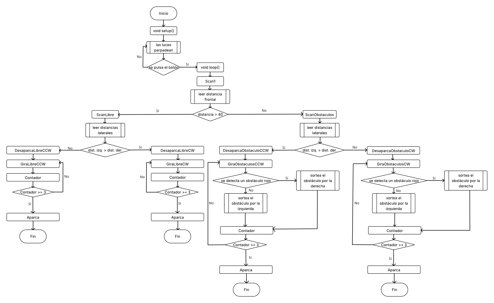
</details>

<details>
<summary><b>🔙 Previous versions</b></summary>
<br>

</details>

#### 8.2 Current programs

<details>
<summary><b>📋 Test programs</b></summary>
<br>
 
These are all programs we used to calibrate our old sensors:

* [Calibrate steering servo](PROGRAMS/11_JOYSTICK_CON_2_SERVOS.ino)
* [Calibrate drive servo](PROGRAMS/POTENCIOMETRO_CON_1_SERVO.ino)
</details>

<details>
<summary><b>💻 Final program</b></summary>
<br>
 
This is our old final program, which allowed us to reach the national WRO final:


</details>

<details>
<summary><b>🔄 Flowchart</b></summary>
<br>
 
Here is a flowchart that will help you understand how our final program works.


</details>

<details>
<summary><b>🔙 Previous versions</b></summary>
<br>

</details>


